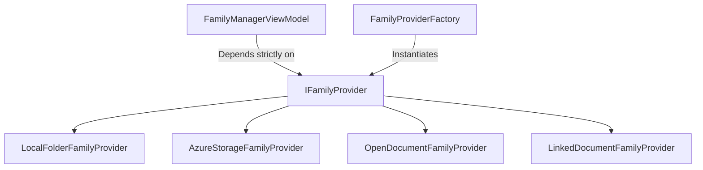

# Architectural Blueprint: Provider Pattern for Multi-Source Data Management in Revit Add-ins

**Date:** 2026-08-03  
**Target Skill:** `csharp-blueprints`  

## 🎯 Overview
When managing data elements originating from diverse sources (e.g. Local Folders, Cloud Containers, Open Documents, Linked Models), ViewModels must **never** contain source-specific logic.

Instead, enforce the **Provider Pattern (`IFamilyProvider`)** to achieve total MVVM decoupling and SOLID compliance.

---

## 🏗️ Class Diagram



---

## 🛠️ Provider Interface Contract

```csharp
public interface IFamilyProvider
{
    string ProviderName { get; }
    FamilySourceType SourceType { get; }

    Task<IEnumerable<FamilyItemModel>> GetFamiliesAsync(CancellationToken cancellationToken = default);
    Task<bool> TransferFamilyAsync(FamilyItemModel familyItem, Document destinationDoc, CancellationToken cancellationToken = default);
}
```

---

## 🔑 Key Architectural Rules
1. **ViewModel Decoupling**: ViewModels call `provider.GetFamiliesAsync()` and `provider.TransferFamilyAsync()` without knowing whether the source is Azure, a folder, or a linked model.
2. **Factory Resolution**: `FamilyProviderFactory` resolves the appropriate concrete `IFamilyProvider` based on selected configuration or active Revit session state.
3. **Async Standard**: All provider operations return `Task<T>` and support `CancellationToken` for cancellation responsiveness.
