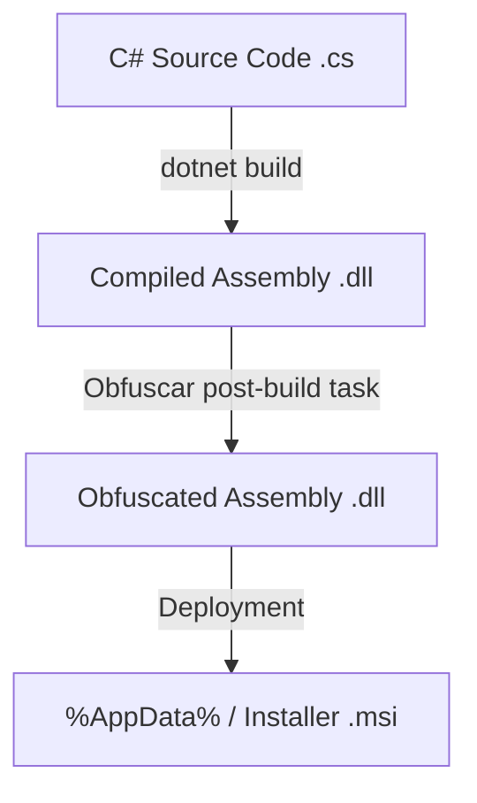

# Revit Add-in Obfuscation & Anti-Tampering Guide

This guide details the integration of **Obfuscar** into Revit Add-in pipelines to protect intellectual property without breaking Revit API reflection or WPF/WebView2 UI bindings.

---

## 1. Post-Compilation Obfuscation Architecture
Unlike source-level tools, a .NET obfuscator like Obfuscar **does not modify C# source files (`.cs`)**. 
Your source code remains untouched and clean. The process is fully post-compilation:



* **Development (Debug):** The assembly is compiled with debug symbols (`.pdb`) and remains unobfuscated. This is ideal for active development and troubleshooting.
* **Production (Release):** The assembly is compiled and then immediately processed by Obfuscar. Names of internal classes, methods, and variables are renamed to unreadable characters, and strings are encrypted.

---

## 2. Revit API & Modeless UI Compatibility Constraints
Revit add-ins rely heavily on **Reflection** and **string-based bindings**. A blind obfuscation of all assemblies will immediately crash the add-in. The following entry points and components must be excluded:

### A. Manifest Entry Points (`IExternalCommand` & `IExternalApplication`)
Revit reads the `<FullClassName>` tag from the `.addin` manifest file. If that class or its namespace is renamed, Revit will throw an "Add-in Load Failure" error.
* **Exclusion Rule:** Always skip renaming of classes implementing these interfaces.

### B. WPF MVVM Binding Properties
WPF databinding (e.g., `{Binding SelectedElement}`) queries properties on ViewModels by matching string names at runtime. If ViewModel properties are renamed (e.g., from `SelectedElement` to `_a`), the UI bindings will fail silently.
* **Exclusion Rule:** Exclude VM classes from property renaming.

### C. WebView2 JS-to-C# Bridge
Classes registered as Javascript host objects (e.g., using `RegisterJsObject` in Chromium/WebView2) receive requests dynamically. If their method names are obfuscated, Javascript calls will fail.
* **Exclusion Rule:** Exclude classes and methods in the WebMessage routing layer.

---

## 3. Code-Behind Exclusions (`[Obfuscation]` Attribute)
To ensure universal applicability across any project, it is best practice to decorate critical classes directly in C# using the system's `Obfuscation` attribute. Obfuscar recognizes this when `ReuseAttributes` is set to `true`:

### Decorating a Revit Command:
```csharp
using System.Reflection;

namespace MyRevitAddin.Commands
{
    [Obfuscation(Exclude = true, ApplyToMembers = true)]
    public class CmdExportDwg : IExternalCommand
    {
        public Result Execute(ExternalCommandData commandData, ref string message, ElementSet elements)
        {
            // The command class remains public/unobfuscated so Revit can find it.
            // Complex inner helper methods here will still be obfuscated if they are in other classes.
            return Result.Succeeded;
        }
    }
}
```

### Decorating a Data Transfer Object (DTO) / JSON Model:
```csharp
using System.Reflection;

namespace MyRevitAddin.Models
{
    [Obfuscation(Exclude = true, ApplyToMembers = true)]
    public class MaterialPayload
    {
        public string MaterialName { get; set; }
        public double Volume { get; set; }
    }
}
```

---

## 4. CI/CD Orchestration (Production vs Development)
To balance obfuscation security with ease of debugging:
1. **Interactive Prompt:** The pipeline script (`build-and-pack.ps1`) prompts the developer to select the configuration:
   * **Production (Release):** Executes full build and triggers the `LocalObfuscationTarget` via MSBuild.
   * **Development (Debug):** Compiles in Debug mode, skips obfuscation, and copies debug symbols (`.pdb`) directly to the Revit Addins directory.
2. **Post-Build Replacement:** The `Obfuscar.targets` file automatically restores `Obfuscar.GlobalTool` using `dotnet tool`, compiles the obfuscated DLL, overrides the original file in the output folder, and cleans up the obfuscation folder.
