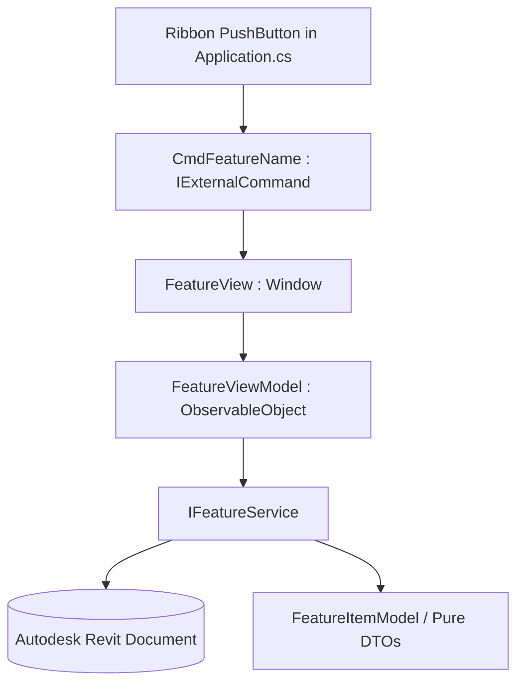

# Technical Plan: [Feature Name]

**Spec ID:** `[00X]`  
**Target Add-in:** `[AddInName]`  
**Status:** DRAFT | APPROVED | IMPLEMENTED  
**Author / Architect:** SDD Architect  

---

## 1. Architectural Overview & Component Diagram

[Describe how the components interact across the decoupled layers: UI (Views), ViewModels, Core Services, and Revit API Commands.]



---

## 2. Layer Definitions & Contracts

### 2.1. Models & DTOs (`/Models/`)
- Pure data classes without references to `Autodesk.Revit.DB.Element`.
- Stores identifiers (`ElementId`, unique IDs), strings, booleans, and localized values.

```csharp
// Example DTO
public class FeatureItemModel
{
    public long Id { get; init; }
    public string Name { get; set; } = string.Empty;
    public bool IsSelected { get; set; }
}
```

### 2.2. Service Interfaces & Contracts (`/Services/`)
- Strict separation between business logic and UI.

```csharp
public interface IFeatureService
{
    IList<FeatureItemModel> CollectTargetElements(Document doc);
    ResultStatus ExecuteMutation(Document doc, IList<FeatureItemModel> items);
}
```

### 2.3. ViewModel & Commands (`/ViewModels/`)
- Built using `CommunityToolkit.Mvvm` (`ObservableObject`, `[ObservableProperty]`, `[RelayCommand]`).
- Commands delegate to injected services. No direct transactions opened in ViewModel.

### 2.4. WPF View & UI System (`/Views/`)
- Custom design system: modern card-based theme, dark/light adaptation.
- **Resource Scoping**: All styles, templates, brushes, and converters declared inline inside `<Window.Resources>`. No `pack://application:,,,/` imports.
- **Virtualization**: `VirtualizingStackPanel.IsVirtualizing="True"` and `ScrollViewer.CanContentScroll="True"` on all collection controls.

### 2.5. Command & Ribbon Integration (`/Commands/` & `Application.cs`)
- `[Transaction(TransactionMode.Manual)]` on `CmdFeatureName.cs`.
- Ribbon registration with 16x16 and 32x32 embedded icons.

---

## 3. Transaction & Failure Handling Architecture

- **Scope**: Wrapped in `using (Transaction tx = new Transaction(doc, "[Action]"))`.
- **Warning Suppression**: Register `WarningSwallower` (`IFailuresPreprocessor`) to silently dismiss harmless warnings:
```csharp
FailureHandlingOptions failureOptions = tx.GetFailureHandlingOptions();
failureOptions.SetFailuresPreprocessor(new WarningSwallower());
tx.SetFailureHandlingOptions(failureOptions);
```
- **Transaction Groups**: Where multi-step operations occur, wrap in `using (TransactionGroup tg = new TransactionGroup(doc, "[Feature]"))` with `tg.Assimilate()`.

---

## 4. Multi-Version Compatibility & Assembly Resolution

- Target SDK versions: Revit 2023–2027.
- Handle `ElementId` across versions:
```csharp
#if REVIT2024_OR_GREATER
    long elementNum = elementId.Value;
#else
    long elementNum = elementId.IntegerValue;
#endif
```
- Verify `AppDomain.CurrentDomain.AssemblyResolve` hook in `Application.cs` for .NET 8 / Revit 2025+.

---

## 5. Security & Zero-Trust Checks

- Path traversal validation on any external export/import path.
- DPAPI protection for sensitive configuration values.
- Newtonsoft.Json configured with `TypeNameHandling.None`.
- Exception telemetry scrubbed of machine paths and usernames.
