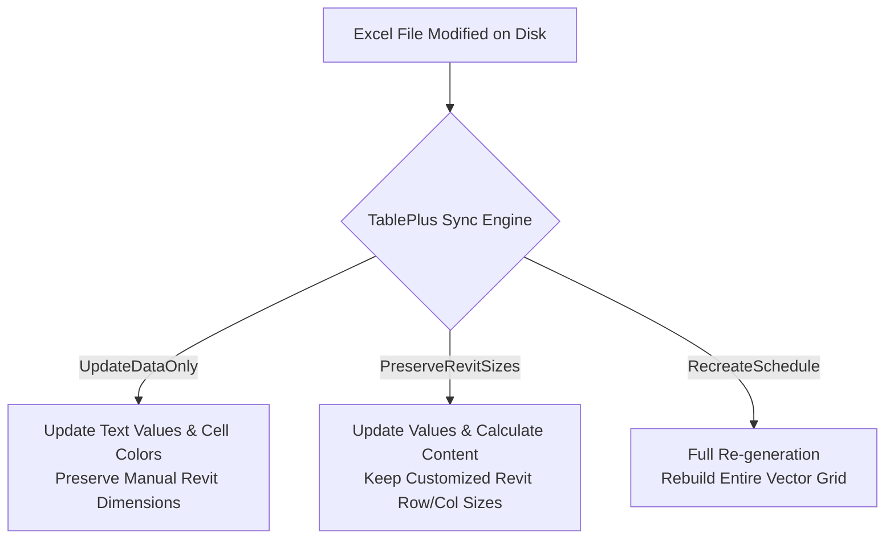

# TablePlus

> **Current Version:** v1.0.0  
> **Add-in ID (GUID):** `C9281744-8B1A-4C23-9D01-B719E022F3AA`  
> **Target Autodesk Revit Versions:** 2024, 2025, 2026, 2027 (Win64)  
> **Publisher:** DBDev Solutions (`DBDev_dbarberos`)  

---

## 1. General Description

**TablePlus** is an enterprise-grade Autodesk Revit add-in designed as a comprehensive tabular and spreadsheet management suite for BIM Managers, architects, structural engineers, and MEP designers. It resolves one of Revit's longest-standing visual documentation challenges: importing complex tabular data (finishes schedules, calculation sheets, door hardware matrices, structural bar schedules, code compliance tables, and drawing notes) directly into project documentation sheets with true graphic fidelity.

Traditional approaches rely on capturing raster screenshots or importing pixelated `.png`/`.jpg` images, resulting in blurry printouts, unselectable text, distorted line weights, and zero intelligence. **TablePlus completely replaces raster imports with a native parametric vector geometry engine**:

- **True 2D Vector Geometry**: Generates crisp, scale-independent Revit detail lines (`DetailCurve`), solid filled regions (`FilledRegion`) for cell background shading, and native Revit text notes (`TextNote`).
- **Typographic Precision**: Extracts and preserves font families, font sizes, weights (bold), styles (italic), underlines, font colors (RGB), and multi-directional text alignments.
- **Merged Cell Reconciliation**: Accurately computes complex rectangular merged cell boundaries, unifying cell perimeters and centering text notes across merged spans.
- **Multi-View Documentation Targets**: Imports spreadsheets directly into **New Drafting Views** (1:1 scale for sheet placement), **Existing Drafting Views**, or **Legend Views** (allowing identical table graphics to be placed across multiple sheets simultaneously).
- **Persistent Extensible Storage Tracking**: Every generated table is stamped with a unique Revit `Extensible Storage` schema (`E3B21D40-6C9A-4E2F-8A11-92D0543B7A1C`), storing source workbook paths, sheet names, cell ranges, and timestamps for automated synchronization.
- **Zero Microsoft Office Dependency**: Operates entirely through high-performance, managed OpenXML libraries (`ClosedXML`), requiring zero client-side installation of Microsoft Excel or COM Interop dependencies.

---

## 2. Requirements and Compatibility

> [!WARNING]
> This add-in is compiled for multiple versions using the `Debug.R[XX]` and `Release.R[XX]` configurations. Ensure you run the compatible build for your Autodesk Revit release.

* **Operating System**: Microsoft Windows 10 / Windows 11 (64-bit).
* **Host Application**: Autodesk Revit 2024, 2025, 2026, 2027 (Win64).
* **Target Frameworks**:
  - Revit 2024: `.NET Framework 4.8`
  - Revit 2025 & 2026: `.NET 8.0`
  - Revit 2027: `.NET 9.0`
* **Microsoft Office Dependency**: **None**. The add-in does not require Microsoft Office, Excel, or Microsoft Access Database Engines to be installed on the machine.

---

## 3. Installation & Uninstallation

### Installation
The installer that ran when you downloaded this plug-in from the Autodesk App Store has already installed the plug-in. You may need to restart the Autodesk product to activate the plug-in.

### Uninstallation
To uninstall this plug-in, exit the Autodesk product if you are currently running it, simply rerun the installer by downloading it again from the Autodesk App Store, and select the 'Uninstall' button, or you can uninstall it from 'Control Panel\Programs\Programs and Features' (Windows 10/11), just as you would uninstall any other application from your system.

---

## 4. Commands and Features Guide

### 4.1. Ribbon Panel Integration
TablePlus integrates into the Autodesk Revit ribbon under the standard **Add-Ins / Complementos** tab:

| Command Button | Function | Technical Class |
|---|---|---|
| **Import Excel** | Opens the interactive Excel Vector Table Import dialog to browse workbooks, select worksheets, configure cell ranges, set target views, and generate vector graphics. | `TablePlus.Commands.CmdImportTable` |
| *(Contextual F1)* | Launches the offline HTML user manual ([help.html](file:///c:/Users/david.barbero/Documents/DOCUMENTOS/ALTEN/Workbench/RevitAddins_Workspace/RevitAddins_Workspace/TablePlus/Resources/help.html)) with full usage instructions. | `TablePlus.Application` |

```text
Ribbon Hierarchy:
[Add-Ins / Complementos] (Tab)
 └── [TablePlus] (Panel)
      └── [Import Excel] (Large PushButton 32x32 with ToolTip & F1 Help)
```

---

## 5. Comprehensive Usage Guide

### 5.1. Source Spreadsheet Selection & Inspection
1. Click the **Import Excel** button in the **Add-Ins / Complementos** ribbon tab.
2. In the **Excel Source File** card:
   - Click **Browse...** to select your target spreadsheet (`.xlsx`, `.xlsm`, `.csv`).
   - The add-in asynchronously opens the workbook in read-only mode and discovers all available worksheets.
   - The active file path is displayed in a read-only path box with ellipsis trimming and full path tooltips.

> [!TIP]
> **Macro-Enabled Workbooks Supported**: TablePlus fully reads `.xlsm` files without triggering security warning dialogs or executing untrusted Excel VBA macros.

---

### 5.2. Worksheet & Cell Range Configuration
1. Select the desired worksheet from the **Worksheet** dropdown selector.
2. Upon selection, TablePlus inspects the worksheet dimensions and automatically populates the **Cell Range** field with the used range address (e.g. `A1:G35`).
3. You can either keep the entire used range or type a custom sub-range (e.g. `B2:E20`, `A1:M100`).
4. **Large Table Performance Ceiling**: If the selected range exceeds **3,000 cells**, an informative warning badge is displayed, recommending splitting the table into multiple views to preserve optimal Revit viewport frame rates.

---

### 5.3. Target View Types & Sheet Placement

TablePlus provides three distinct target view configurations:

| Target View Option | Revit View Class | Typical Use Case |
|---|---|---|
| **New Drafting View** | `ViewDrafting` | Creates a clean, isolated 1:1 Drafting View (e.g., `Table_DoorSchedule_20260923`). Ideal for standalone schedules, calculation matrices, and sheet details. |
| **Existing Drafting View** | `ViewDrafting` | Inserts the vector table directly into the currently active drafting view, allowing composite detail sheets combining CAD details, text, and tables. |
| **Legend View** | `ViewLegend` / `ViewDrafting` | Creates a reusable legend view. Unlike standard drafting views, Legend Views can be placed simultaneously across multiple documentation sheets without duplicating elements. |

- **Scale Configuration**: Default view scale is set to `1:1` to match physical millimeter/inch table dimensions directly to paper space.

---

### 5.4. High-Fidelity Vector Rendering Engine

The core geometry engine converts cell bounds and formatting into native Revit database elements:

#### A. Parametric Detail Lines (Cell Borders)
- Every cell border is converted to a Revit `DetailCurve` (detail line).
- **Line Style Mapping**: Thin, medium, thick, double, and dashed Excel borders are mapped to matched project `GraphicsStyle` lines (e.g., `<Thin Lines>`, `<Medium Lines>`, `<Wide Lines>`).
- **Border Deduping**: Overlapping adjacent borders between neighboring cells are reconciled into single line instances to eliminate redundant visual weight and prevent graphics overlap warnings.

#### B. Cell Background Fill Shading
- Cells with fill colors are rendered as native Revit `FilledRegion` elements.
- Uses solid fill patterns (`FillPatternElement`) with exact 24-bit RGB color matching.
- Cells without background color are kept transparent, ensuring clean placement over titleblocks or sheet grids.

#### C. Merged Cell Boundary Reconciliation
- Rectangular merged cell ranges (e.g. `A1:D1` header titles) are unified into single bounding polygons.
- Internal dividing borders are removed automatically.
- Text note placement is dynamically centered across the full combined width and height of the merged boundary.

#### D. Typographic Matching & Text Notes
- Text notes are instantiated via `TextNote.Create()`.
- Automatically extracts:
  - Font family (falls back gracefully to Arial if the specified font is absent on the operating system).
  - Font size in points, scaled to paper millimeters/feet.
  - Bold and Italic font styles.
  - Font foreground color (RGB).
  - Horizontal Alignment: Left, Center, Right.
  - Vertical Alignment: Top, Middle, Bottom.

#### E. Silent Failure Preprocessing (`WarningSwallower`)
All geometry creation transactions are guarded by an `IFailuresPreprocessor` (`WarningSwallower`). Non-fatal Revit warnings (such as microscopic line offsets or benign overlaps) are swallowed silently without halting execution or prompting annoying dialog popups.

---

### 5.5. Extensible Storage Metadata Tracking

Every view generated by TablePlus is permanently stamped with an Extensible Storage schema registered under GUID:
```text
Schema GUID: E3B21D40-6C9A-4E2F-8A11-92D0543B7A1C
Schema Name: TablePlus_ImportMetadata
```

The schema stores:
- `SourceFilePath` (`StringType`): Absolute path to the source Excel workbook.
- `SheetName` (`StringType`): Name of the worksheet imported.
- `RangeAddress` (`StringType`): Imported cell range address (e.g. `A1:F25`).
- `LastImportTimestampUtc` (`StringType`): UTC timestamp of import (ISO 8601).
- `UpdateBehavior` (`Int32Type`): Integer identifier representing the active sync strategy.

This metadata enables automated table reloads, missing link detection, and batch model synchronization across project milestones.

---

### 5.6. Future Sync & Reload Roadmap (Architectural Alignment)

In alignment with the TablePlus Constitution and DiRoots TableGen reference patterns, future specifications will activate the following synchronization behaviors using the Extensible Storage schema:



- **UpdateDataOnly**: Refreshes text values, numeric calculations, and background fills while keeping user-adjusted column widths and manual annotations in Revit intact.
- **PreserveRevitColumnRowSizes**: Updates all tabular content while preserving custom column and row dimensions set inside the Revit view.
- **RecreateSchedule**: Performs a full clean sweep and regenerates the table from scratch matching the modified spreadsheet dimensions.

---

### 5.7. Modern FilterPlus Card-Based User Interface

The user interface is built on the **FilterPlus modern design system**:
- **Visual Separation**: Features organized cards for *Excel Source File*, *Worksheet & Range*, and *Target View Configuration*.
- **Inline XAML Resources**: Zero external resource dictionary dependencies (`pack://application:,,,/`), eliminating Revit unmanaged host `XamlParseException` crashes.
- **Real-Time Validation**: Submit button (`Import`) is disabled until a valid file, worksheet, and view configuration are supplied, with clear validation status messages.

---

## 6. Multi-Version Architecture & Build Orchestration

TablePlus is engineered for enterprise monorepo deployment covering four major Autodesk Revit releases:

### 6.1. Build Configurations

| Revit Version | .NET Runtime | Build Configuration | Assembly Output |
|---|---|---|---|
| **Revit 2024** | .NET Framework 4.8 | `Release.R24` / `Debug.R24` | `bin/Release.R24/publish/TablePlus.dll` |
| **Revit 2025** | .NET 8.0 | `Release.R25` / `Debug.R25` | `bin/Release.R25/publish/TablePlus.dll` |
| **Revit 2026** | .NET 8.0 | `Release.R26` / `Debug.R26` | `bin/Release.R26/publish/TablePlus.dll` |
| **Revit 2027** | .NET 9.0 | `Release.R27` / `Debug.R27` | `bin/Release.R27/publish/TablePlus.dll` |

### 6.2. Local Build Pipeline (`TablePlus/build-and-pack.ps1`)
Developers can compile and package the add-in locally via the interactive orchestrator:
```powershell
.\TablePlus\build-and-pack.ps1
```
Prompts for:
1. **Production**: Builds `Release.R24` with automated Obfuscar anti-tampering protection.
2. **Development**: Builds `Debug.R24` with full PDB symbols and verbose diagnostic logs.

### 6.3. Autodesk App Store Bundle Packaging
The entire multi-version deliverable is packaged using the standardized automated builder:
```powershell
powershell -ExecutionPolicy Bypass -Command "& .\.agents\skills\revit-appstore-bundle\scripts\build-bundle.ps1 -AppName 'TablePlus' -Version '1.0.0' -Author 'DBDev_dbarberos' -Email 'dbarberos@outlook.com' -ProjectDir '.\TablePlus' -TargetYears @('2024', '2025', '2026', '2027')"
```

#### Bundle Structure:
```text
TablePlus.bundle/
├── PackageContents.xml       # Autoloader manifest with SeriesMin/SeriesMax "R2024".."R2027"
└── Contents/
    ├── Resources/            # Shared Icons (16x16, 32x32) and help.html
    ├── 2024/                 # Complete .NET 4.8 binaries, ClosedXML, and TablePlus.addin
    ├── 2025/                 # Complete .NET 8 binaries, ClosedXML, and TablePlus.addin
    ├── 2026/                 # Complete .NET 8 binaries, ClosedXML, and TablePlus.addin
    └── 2027/                 # Complete .NET 9 binaries, ClosedXML, and TablePlus.addin
```

---

## 7. Version History (Changelog)

### v1.0.0 - 2026-09-23

#### Added
- **ClosedXML Managed Excel Engine**: Integrated `ClosedXML` and `DocumentFormat.OpenXml` for reading `.xlsx`, `.xlsm`, and `.csv` files without requiring Microsoft Office or Excel COM Interop installed.
- **Native Vector Geometry Engine (`TableGeometryService`)**:
  - Parametric cell grid generation using Revit detail lines (`DetailCurve`).
  - Solid background fill shading using Revit `FilledRegion` with true 24-bit RGB colors.
  - Rectangular merged cell boundary reconciliation and centered multi-cell text placement.
  - Typographic precision reproducing font family, font size, bold, italic, underline, text color, and alignments.
- **Flexible View Placement**: Support for creating new **Drafting Views** (1:1 scale), targeting active **Existing Drafting Views**, or generating **Legend Views** for multi-sheet reuse.
- **Extensible Storage Metadata Service (`SchemaService`)**:
  - Registered schema `E3B21D40-6C9A-4E2F-8A11-92D0543B7A1C` stamping source file path, sheet name, cell range, UTC timestamp, and update mode onto created views.
- **Modern FilterPlus Card-Based WPF UI (`TableImportView`)**:
  - Three distinct functional cards for file browsing, sheet selection, and view configuration.
  - Inline resource declarations eliminating `pack://application:,,,/` crashes.
  - Asynchronous background file inspection with reactive UI bindings via `CommunityToolkit.Mvvm`.
- **Silent Warning Swallower (`WarningSwallower`)**: Automatic suppression of non-fatal geometry warnings via `IFailuresPreprocessor`.
- **Multi-Version Architecture (Revit 2024–2027)**:
  - Full support and clean compilation for Autodesk Revit 2024, 2025, 2026, and 2027.
  - Autoloader-compliant `TablePlus.bundle` package with `"R"` series prefix (`R2024`, `R2025`, `R2026`, `R2027`).
  - Isolated dependency bundling for each Revit version folder.
- **Autodesk App Store Publish Suite**:
  - Complete publish metadata package (`AppDescription.md`, `PrivacyPolicy.md`, `Steps.md`, `DigitalSignatureInfo.md`, `WebsiteInfo.txt`).
  - Standardized Ribbon icons (`Icon16.png`, `Icon32.png`) and offline HTML help ([help.html](file:///c:/Users/david.barbero/Documents/DOCUMENTOS/ALTEN/Workbench/RevitAddins_Workspace/RevitAddins_Workspace/TablePlus/Resources/help.html)).

---

## 8. Support and Contact

To report bugs, suggest features, or request technical support:
* **Developer**: DBDev_dbarberos
* **Company**: DBDev Solutions
* **Support Email**: [dbarberos@outlook.com](mailto:dbarberos@outlook.com)
* **Website**: [https://dbdev-dbarberos.github.io](https://dbdev-dbarberos.github.io)
* **Documentation & Privacy Policy**: [https://dbdev-dbarberos.github.io/PrivacyPolicy/](https://dbdev-dbarberos.github.io/PrivacyPolicy/)
