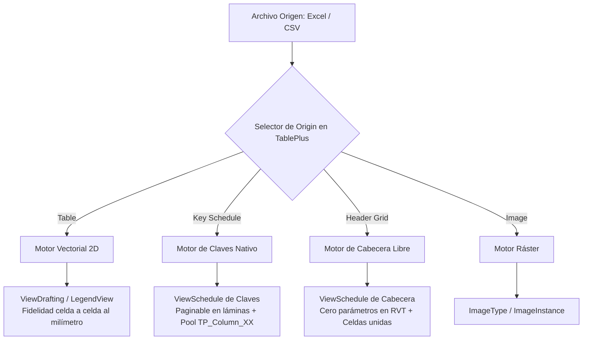
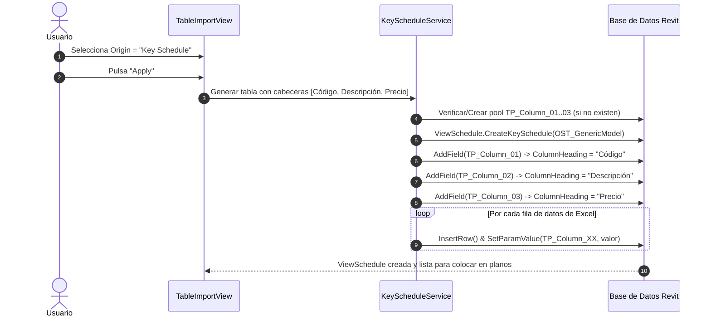

# Plan de Actuación: Opciones de Tablas Nativas (Key Schedule y Header Section) en TablePlus

**Documento:** Plan de Arquitectura e Implementación  
**Módulo:** `TablePlus` — Diálogo *Add Table* (`TableImportView`) y Motores de Generación  
**Fecha:** 2026-10-05  
**Autor:** SDD Polyglot Architect  
**Estado:** COMPLETADO (Validado en .NET 8 y .NET Framework 4.8)  

---

## 1. Contexto y Objetivos

Actualmente, el asistente de importación por lotes de **TablePlus** (`TableImportView`) cuenta en su tarjeta inferior *"Table properties"* con un selector de **Origin** restringido a dos modalidades:
* **`Table`:** Genera entidades vectoriales 2D (líneas de detalle, textos y tramas rellenas) en vistas de diseño (`DraftingView`) o leyendas (`LegendView`).
* **`Image`:** Inserta la hoja como imagen ráster de alta resolución.

El objetivo de este plan es ampliar el selector **Origin** para admitir la generación directa de **Tablas de Planificación Nativas de Revit (`ViewSchedule`)** a partir de archivos externos (Excel, CSV), resolviendo el compromiso entre:
1. **Manipulación como tabla de planificación nativa de Revit** (arrastrable a láminas, paginable con *Split Schedule* y con estilos nativos de Revit).
2. **Control estricto de la base de datos de Revit** para evitar la **contaminación de parámetros** (*parameter pollution*).
3. **Claridad absoluta en la UI** para que el usuario conozca las ventajas, limitaciones e implicaciones técnicas de cada opción antes de importar.

---

## 2. Matriz de Opciones Técnicas Evaluadas

### Tabla Comparativa de Soluciones

| Característica | 1. Vector Table (`Table`) | 2. Key Schedule (`KeySchedule`) | 3. Header Grid (`HeaderSchedule`) | 4. Image (`Image`) |
|---|---|---|---|---|
| **Tipo de Vista Generada** | `DraftingView` o `LegendView` | `ViewSchedule` (Claves) | `ViewSchedule` (Estándar/Cabecera) | `DraftingView` o `LegendView` |
| **Creación de Parámetros** | **Ninguno (0)** | **Pool acotado (`TP_Column_01..20`)** | **Ninguno (0)** | **Ninguno (0)** |
| **División en Láminas (*Split*)** | No (como vista de dibujo) | **SÍ (Nativo de Revit)** | No (cabecera no se divide) | No (gráfico continuo) |
| **Celdas Unidas (*Merge*)** | **SÍ (Total)** | No en cuerpo de datos | **SÍ (En cabecera)** | SÍ (como imagen) |
| **Colores y Fuentes por Celda** | **SÍ (Exacto a Excel)** | No (estilo global de Revit) | Limitado (global de cabecera) | SÍ (como imagen) |
| **Edición Post-Importación** | Textos y líneas 2D | Grilla de tabla de Revit | Grilla de cabecera de Revit | No editable |
| **Caso de Uso Óptimo** | Cuadros de superficies complejos, tablas con colores y formatos ricos | Tablas extensas (+30 filas), listados de materiales, especificaciones que requieren paginación en planos | Cuadros de notas, tablas compactas (1-30 filas) donde se prohíbe crear parámetros | Hojas gráficas, diagramas o PDFs escaneados |

---

## 3. Decisiones Arquitectónicas y Consecuencias

### Decisión 1: Mitigación de la Contaminación de Parámetros en Key Schedules
* **Problema:** Si cada columna de un archivo Excel crea un parámetro de proyecto con su nombre (`Proveedor`, `Precio`, `Subcontrata`), tras importar varios archivos el proyecto acumula decenas de parámetros obsoletos o redundantes en la categoría *Modelos genéricos*.
* **Solución adoptada:** **Patrón de Pool Reutilizable de Columnas (`Column Pool Pattern`)**:
  * Se define un grupo de parámetros compartidos gestionados por TablePlus: `TP_Column_01`, `TP_Column_02`, ..., `TP_Column_20` (tipo `Text`, grupo `GroupTypeId.Data`).
  * En la tabla de planificación, la propiedad `ScheduleField.ColumnHeading` se renombra dinámicamente con el texto real de la cabecera de Excel (ej. `"Proveedor"` o `"Importe Total"`).
  * **Consecuencia:** Se garantiza que el archivo de Revit **nunca tendrá más de N parámetros fijos**, independientemente de que se creen 1 o 100 tablas de claves diferentes.
  * **Aislamiento de datos:** Cada tabla de claves crea sus propias instancias de clave en la base de datos de Revit; los datos de una tabla no interfieren con los de otra aunque compartan los parámetros `TP_Column_XX`.

### Decisión 2: Disponibilidad Simultánea de "Key Schedule" y "Header Grid"
* **Justificación:** Los requerimientos de los proyectos BIM varían según el cliente y el Plan de Ejecución BIM (BEP):
  * Proyectos con estricta política de **"Cero Parámetros Nuevos"** pueden recurrir a **Header Grid**.
  * Proyectos que requieren **paginar tablas largas en láminas de entrega** recurren a **Key Schedule**.
* **Consecuencia:** El add-in ofrece máxima flexibilidad sin imponer una única filosofía al usuario.

### Decisión 3: Interfaz Reactiva y Asistida en la Tarjeta "Table properties"
* **Controles afectados:**
  1. **`Origin` (ComboBox):** 4 opciones con nombres directos:
     * `Table (Vector Lines & Text)`
     * `Key Schedule (Data Grid)`
     * `Header Grid (Param-Free)`
     * `Image (High-Resolution Raster)`
  2. **Badge Informativo Dinámico:** Justo debajo del desplegable `Origin`, un contenedor sutil con icono `ℹ️` actualiza su texto para explicar pros, contras y advertencias de la opción activa.
  3. **`Type of view` (ComboBox):**
     * Si `Origin` es `Key Schedule` o `Header Grid`, se fija en `Schedule View` y se **inhabilita** (evita combinaciones inválidas).
     * Si `Origin` es `Table` o `Image`, se habilita para conmutar entre `Legend View` y `Drafting View`.
  4. **`Scale` (TextBox):**
     * Si `Origin` es `Key Schedule` o `Header Grid`, se **deshabilita** mostrando `"N/A"` (las tablas de planificación en Revit no utilizan escala métrica).
     * Si `Origin` es `Table` o `Image`, se habilita para introducir la escala (ej. `1`, `50`, `100`).

---

## 4. Plan de Trabajo Desglosado por Fases

### Fase 1: Extensión de Dominio, Enums y UI de "Add Table" (Inmediata)
- [x] **T1.1:** Actualizar `TableEnums.cs` añadiendo `TableImportType.KeySchedule` y `TableImportType.HeaderSchedule`.
- [x] **T1.2:** Actualizar `Converters.cs` en `EnumDisplayConverter` para formatear las 4 opciones en modo compacto y detallado.
- [x] **T1.3:** Añadir propiedades reactivas en `TableBatchSheetItemModel.cs` y `TableImportViewModel.cs`:
  - `IsViewTypeSelectable`: `bool` que deshabilita el selector de tipo de vista cuando se eligen opciones de tabla nativa.
  - `IsScaleSelectable`: `bool` que deshabilita el campo de escala.
  - `OriginHelpText` y `OriginHelpSeverity`: textos informativos dinámicos.
- [x] **T1.4:** Modificar `TableImportView.xaml` para incorporar el badge informativo bajo `Origin:`, y enlazar `IsEnabled` de `Type of view` y `Scale`.
- [x] **T1.5:** Validación de compilación en .NET 8 (Revit 2025+) y .NET Framework 4.8 (Revit 2024).

### Fase 2: Motor de Creación de Parámetros y Tablas de Claves (`KeyScheduleService`)
- [x] **T2.1:** Implementar servicio de gestión de parámetros compartidos temporales (`SharedParameterPoolService.cs`) para garantizar la creación o vinculación del pool `TP_Column_01..20` a `BuiltInCategory.OST_GenericModel`.
- [x] **T2.2:** Implementar `KeyScheduleService.cs`:
  - Creación de `ViewSchedule.CreateKeySchedule`.
  - Configuración de campos con `ColumnHeading` personalizado.
  - Inserción de filas de datos y asignación de valores de texto.
  - Estampado de metadatos en Extensible Storage (`SchemaService`) para trazabilidad y sincronización futura.

### Fase 3: Motor de Creación en Cabecera Libre (`HeaderScheduleService`)
- [x] **T3.1:** Implementar `HeaderScheduleService.cs`:
  - Creación de `ViewSchedule.CreateSchedule` sobre categoría neutra con filtro imposible (cero elementos en cuerpo) y ocultando cabeceras de cuerpo.
  - Configuración de `TableSectionData` en `SectionType.Header`: inserción de filas, columnas y escritura de celdas libres.
  - Soporte de celdas combinadas (`MergeCells`) para cabeceras complejas de Excel.
  - Estampado de metadatos en Extensible Storage.

### Fase 4: Integración en Motor Batch y Dashboard Principal
- [x] **T4.1:** Conectar el despachador en `TableImportViewModel.ImportBatchTablesAsync` para invocar según el `SelectedImportType` de cada hoja:
  - `Table` -> `TableGeometryService.GenerateTable`
  - `KeySchedule` -> `KeyScheduleService.GenerateKeySchedule`
  - `HeaderSchedule` -> `HeaderScheduleService.GenerateHeaderSchedule`
  - `Image` -> `ImageService.GenerateImageTable`
- [x] **T4.2:** Soporte en `MainWindowViewModel` y `TableRegistryService` para identificar, filtrar y sincronizar tablas de claves y tablas de cabecera ya existentes en el modelo.
- [x] **T4.3:** Verificación de ciclo completo, compilación limpia multi-versión y documentación final.

---

## 5. Criterios de Aceptación (Quality Gate)

1. **Intuitividad UI:** Al cambiar entre `Table`, `Key Schedule`, `Header Grid` e `Image`, los campos `Type of view` y `Scale` deben reaccionar inmediatamente (bloqueándose con `"Schedule View"` y `"N/A"` cuando corresponda), y el badge explicativo debe reflejar las implicaciones técnicas.
2. **Cero Fuga de Eventos:** Los clics en los nuevos desplegables no deben interferir con la selección de filas ni con los checkboxes de hojas en el DataGrid jerárquico.
3. **Control de Parámetros:** La opción `Key Schedule` jamás debe crear parámetros con nombres arbitrarios ilimitados; debe ceñirse al pool controlado `TP_Column_XX`.
4. **Pureza en Header Grid:** La opción `Header Grid` no debe registrar ningún parámetro en la base de datos de Revit.
5. **Compilación Multi-Target:** El proyecto debe compilar con 0 advertencias y 0 errores tanto en `Debug R24` (.NET Framework 4.8) como en `Debug R25` (.NET 8).
