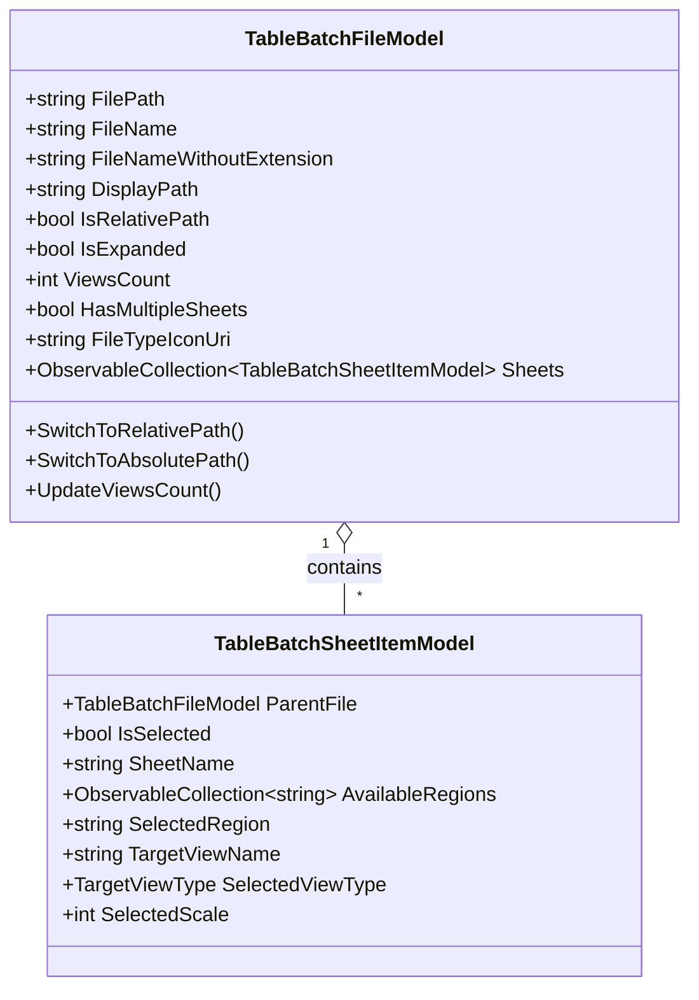

# Walkthrough: Hierarchical "Add Tables" DataGrid & File Sub-Row Architecture

**Date:** 2026-10-01  
**Add-in:** TablePlus (Autodesk Revit 2024 & 2025)  
**Component:** `TableImportView`, `TableImportViewModel`, `TableBatchFileModel`, `TableBatchSheetItemModel`, `ExcelReaderService`

---

## 1. Overview & Objectives

Streamlined the **"Add Tables"** dialog (`TableImportView.xaml`) to implement a clean 4-column hierarchical view for loaded files and their respective worksheets/pages:

1. **Column 1 ("Views"):** Displays the count of active sheets/views selected for import. Shows an expand/collapse toggle chevron (`▶` / `▼`) when the file contains multiple sheets (`HasMultipleSheets == true`).
2. **Column 2 (Sheet Icon Header & File Type Icon):** Features a 16x16 sheet document icon in the column header and displays dedicated 16x16 format-specific icons in cells (`FileExcel16.png`, `FileCsv16.png`, `FileWord16.png`, `FilePdf16.png`, `FileText16.png`, `FileGeneric16.png`).
3. **Column 3 ("File"):** Displays the filename without its extension (`FileNameWithoutExtension`).
4. **Column 4 ("Path"):** Displays the file path with full context menu support (right-click) allowing the user to seamlessly switch between **Absolute Path** and **Relative Path** (computed dynamically against the active Revit document directory).
5. **Hierarchical Row Details (`RowDetailsTemplate`):** Unfolds sub-rows for each worksheet/page in the file. Each sub-row hosts:
   - Selection `CheckBox` (checked by default).
   - Sheet name with a miniature document bullet icon.
   - Right-aligned printable area / region dropdown (`ComboBox`) presenting `"Entire Worksheet"`, defined Excel Print Areas (`Print Area (A1:G20)`), and Named Ranges.
6. **Footer Synchronization:** The Selection dropdown (`Select All`, `Deselect All`, `Invert Selection`) cascades to all sheet checkboxes, updating the views count in Column 1 and the total batch counter dynamically.

---

## 2. Architecture & Data Structures

---

## 3. Key Implementation Highlights

- **Dynamic Relative Path Calculation:**
  Computes relative paths against the Revit project folder (`_doc.PathName`) using `Uri.MakeRelativeUri`, preserving uniform Windows separators (`.\Spreadsheets\Doc.xlsx`) across both .NET Framework 4.8 and .NET 8.
- **ClosedXML PageSetup Print Area Extraction:**
  `ExcelReaderService.InspectWorkbook` inspects `ws.PageSetup.PrintAreas` and stores detected addresses (`pa.RangeAddress.ToStringRelative()`) as available printable regions alongside workbook defined names.
- **WPF DataGrid Virtualization & RowDetails Binding:**
  Configured `RowDetailsVisibilityMode="Visible"` with `DetailsVisibility` bound to `IsExpanded` on each `DataGridRow`, preventing UI thread freezes or accidental expansions during selection changes.

---

## 4. Verification & Deployment Status

- **Revit 2025 (.NET 8):** Succeeded (0 Warnings, 0 Errors) -> Deployed to `AppData\Roaming\Autodesk\Revit\Addins\2025\`
- **Revit 2024 (.NET Framework 4.8):** Succeeded (0 Warnings, 0 Errors) -> Deployed to `AppData\Roaming\Autodesk\Revit\Addins\2024\`
