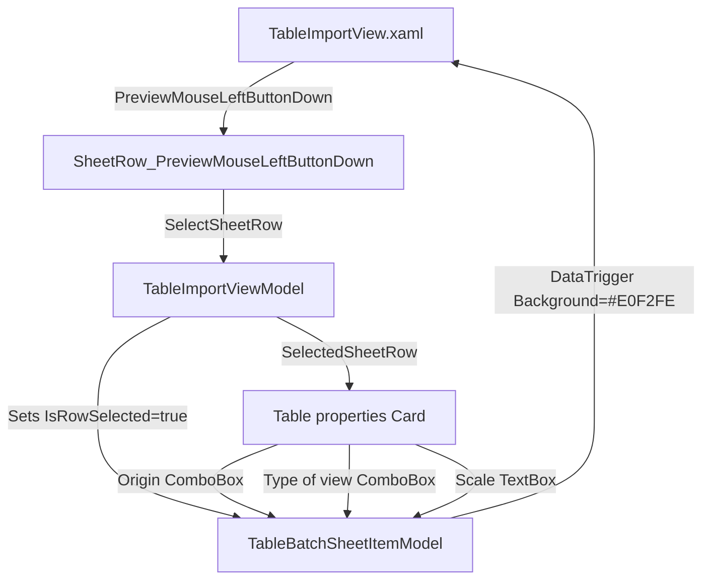

# Walkthrough: "Table Properties" Card & Interactive Sheet Row Selection

**Date:** 2026-10-03  
**Add-in:** TablePlus (Autodesk Revit 2024 & 2025)  
**Components:** `TableImportView`, `TableImportViewModel`, `TableBatchSheetItemModel`, `TableBatchFileModel`

---

## 1. Overview & Objectives

In this phase, we completed two key visual and functional enhancements to the **"Add Tables"** dialog (`TableImportView.xaml`):

1. **Persistent Sheet Row Selection Highlight (Light Blue `#E0F2FE`):**
   - Individual worksheet lines within the collapsible file container now highlight with a light blue background (`RowHoverBrush`) when clicked to indicate that the sheet is actively selected.
   - The selection is exclusive across the batch hierarchy (clicking another sheet updates the active selection and reverts the previous one).
   - Mouse hover triggers the same light blue feedback, but only the actively selected sheet retains the highlight when the mouse moves away.
   - Parent file rows maintain their crisp white background (`#FFFFFF`) with straight borders (`CornerRadius="0"`).
   - Event bubbling is preserved (`e.Handled = false`), so child `CheckBox` (import toggle) and `ComboBox` (printable area/region) controls function without interference.

2. **"Table properties" Detail Card:**
   - Positioned beneath the main DataGrid (`Grid.Row="2"`) with straight borders (`CornerRadius="0"`), crisp borders (`#E0E0E0`), and clean typography.
   - Houses a vertical stack of three property rows:
     - **"Origin:"** `ComboBox` offering `"Table"` (editable vector lines & text) and `"Image"` (raster rendering), formatted via `EnumDisplayConverter`.
     - **"Type of view:"** `ComboBox` offering Revit view types (`Drafting View`, `Legend View`, `Schedule View`).
     - **"Scale:"** Numeric input `TextBox` bound to `ScaleInputText` with integer validation (`int.TryParse`, $> 0$) allowing custom view scale definition relative to the origin.
   - Form-aware defaults:
     - **Table-compatible documents** (`.xlsx`, `.xlsm`, `.csv`, `.tsv`, `.txt`, `.docx`, etc.): Origin = `Table`, Type of view = `Legend View`, Scale = `1`.
     - **PDF documents** (`.pdf`): Origin = `Image`, Type of view = `Legend View`, Scale = `1`.
   - Reactive two-way synchronization:
     - Editing properties in the card immediately updates the selected sheet row model (`TableBatchSheetItemModel`).
     - Clicking a sheet line in the DataGrid instantly updates the card fields to display that sheet's specific configuration.
     - Selecting a parent file row automatically selects its first sheet if none of its sheets was currently active.
     - Card controls automatically disable/enable via `HasSelectedSheetRow` when no files are loaded.

---

## 2. Architecture & Data Binding



### Data Structures & Properties

| Class | Property / Method | Description |
|---|---|---|
| [`TableBatchSheetItemModel`](file:///B:/REVIT/C%23/RevitAddins_Workspace/TablePlus/Models/TableBatchSheetItemModel.cs) | `bool IsRowSelected` | Observable flag determining whether this sheet is actively highlighted in the grid. |
| [`TableBatchSheetItemModel`](file:///B:/REVIT/C%23/RevitAddins_Workspace/TablePlus/Models/TableBatchSheetItemModel.cs) | `string ScaleInputText` | Two-way string wrapper for `SelectedScale` with `int.TryParse` validation. |
| [`TableBatchSheetItemModel`](file:///B:/REVIT/C%23/RevitAddins_Workspace/TablePlus/Models/TableBatchSheetItemModel.cs) | `TargetViewType SelectedViewType` | Target view type (defaults to `LegendView`). |
| [`TableBatchSheetItemModel`](file:///B:/REVIT/C%23/RevitAddins_Workspace/TablePlus/Models/TableBatchSheetItemModel.cs) | `TableImportType SelectedImportType` | Origin format (`Table` for spreadsheets/docs, `Image` for PDF). |
| [`TableImportViewModel`](file:///B:/REVIT/C%23/RevitAddins_Workspace/TablePlus/ViewModels/TableImportViewModel.cs) | `TableBatchSheetItemModel? SelectedSheetRow` | The currently active sheet row bound to the "Table properties" card. |
| [`TableImportViewModel`](file:///B:/REVIT/C%23/RevitAddins_Workspace/TablePlus/ViewModels/TableImportViewModel.cs) | `void SelectSheetRow(targetSheet)` | Exclusively activates `targetSheet.IsRowSelected`, clears others, syncs `SelectedBatchFile`, and logs to `LoggerService`. |
| [`TableImportViewModel`](file:///B:/REVIT/C%23/RevitAddins_Workspace/TablePlus/ViewModels/TableImportViewModel.cs) | `bool HasSelectedSheetRow` | Controls `IsEnabled` state of the "Table properties" card. |

---

## 3. Key Implementation Highlights

### A. Non-Interfering Row Click Selection (`PreviewMouseLeftButtonDown`)
In `TableImportView.xaml.cs`:
```csharp
private void SheetRow_PreviewMouseLeftButtonDown(object sender, System.Windows.Input.MouseButtonEventArgs e)
{
    if (sender is FrameworkElement fe && fe.DataContext is TableBatchSheetItemModel sheetModel)
    {
        _viewModel.SelectSheetRow(sheetModel);
        // Note: e.Handled remains false so child CheckBox and ComboBox controls receive clicks normally.
    }
}
```

### B. Inline Style Triggers for Hover and Persistent Selection
In `TableImportView.xaml`:
```xml
<Border BorderThickness="0" Padding="32,2,12,2"
        PreviewMouseLeftButtonDown="SheetRow_PreviewMouseLeftButtonDown"
        Cursor="Hand">
    <Border.Style>
        <Style TargetType="Border">
            <Setter Property="Background" Value="Transparent"/>
            <Style.Triggers>
                <Trigger Property="IsMouseOver" Value="True">
                    <Setter Property="Background" Value="{StaticResource RowHoverBrush}"/>
                </Trigger>
                <DataTrigger Binding="{Binding IsRowSelected}" Value="True">
                    <Setter Property="Background" Value="{StaticResource RowHoverBrush}"/>
                </DataTrigger>
            </Style.Triggers>
        </Style>
    </Border.Style>
    <!-- Child row controls (CheckBox, Sheet Name, Area ComboBox) -->
</Border>
```

### C. "Table properties" Card XAML Layout
```xml
<!-- ROW 2: TABLE PROPERTIES CARD -->
<Border Grid.Row="2" Style="{StaticResource CardBorderStyle}" CornerRadius="0" Padding="12,10" Margin="0,0,0,6">
    <StackPanel Orientation="Vertical">
        <TextBlock Text="Table properties" FontWeight="Bold" FontSize="12" Foreground="#999" Margin="0,0,0,8"/>
        <Grid IsEnabled="{Binding HasSelectedSheetRow}">
            <Grid.RowDefinitions>
                <RowDefinition Height="Auto"/>
                <RowDefinition Height="Auto"/>
                <RowDefinition Height="Auto"/>
            </Grid.RowDefinitions>
            <Grid.ColumnDefinitions>
                <ColumnDefinition Width="105"/>
                <ColumnDefinition Width="220"/>
                <ColumnDefinition Width="*"/>
            </Grid.ColumnDefinitions>

            <!-- Origin: Table / Image -->
            <TextBlock Grid.Row="0" Grid.Column="0" Text="Origin:" ... />
            <Border Grid.Row="0" Grid.Column="1" ...>
                <ComboBox ItemsSource="{Binding AvailableImportTypes}"
                          SelectedItem="{Binding SelectedSheetRow.SelectedImportType, Mode=TwoWay, UpdateSourceTrigger=PropertyChanged}" ... />
            </Border>

            <!-- Type of view: Drafting View / Legend View / Schedule View -->
            <TextBlock Grid.Row="1" Grid.Column="0" Text="Type of view:" ... />
            <Border Grid.Row="1" Grid.Column="1" ...>
                <ComboBox ItemsSource="{Binding AvailableViewTypes}"
                          SelectedItem="{Binding SelectedSheetRow.SelectedViewType, Mode=TwoWay, UpdateSourceTrigger=PropertyChanged}" ... />
            </Border>

            <!-- Scale: Numeric TextBox (default: 1) -->
            <TextBlock Grid.Row="2" Grid.Column="0" Text="Scale:" ... />
            <Border Grid.Row="2" Grid.Column="1" ...>
                <TextBox Text="{Binding SelectedSheetRow.ScaleInputText, Mode=TwoWay, UpdateSourceTrigger=PropertyChanged}" ... />
            </Border>
        </Grid>
    </StackPanel>
</Border>
```

---

## 4. Verification & Build Results

Both target configurations compiled and published with 0 warnings and 0 errors:

- **Revit 2025 (.NET 8):** Succeeded -> Deployed to `AppData\Roaming\Autodesk\Revit\Addins\2025\`
- **Revit 2024 (.NET Framework 4.8):** Succeeded -> Deployed to `AppData\Roaming\Autodesk\Revit\Addins\2024\`
