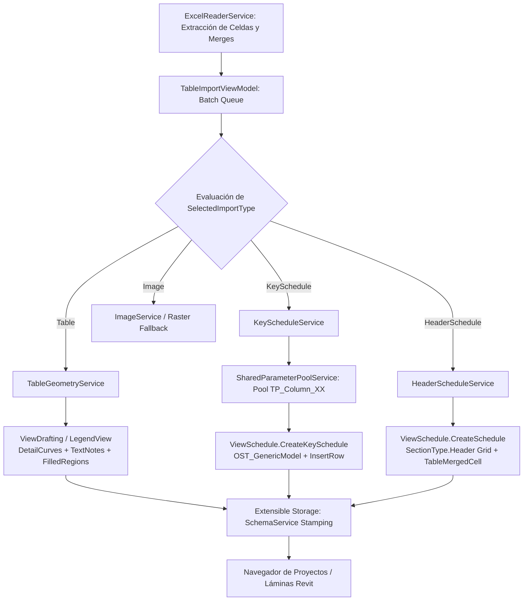

# Walkthrough: Opciones de Tablas Nativas (Key Schedule y Header Section) en TablePlus

**Fecha:** 2026-10-05  
**Add-in:** TablePlus (Autodesk Revit 2024 a 2027)  
**Componentes Principales:**
* `TableEnums.cs` (`TableImportType`)
* `TableImportView.xaml` (Tarjeta *Table properties* con controles reactivos y badge informativo)
* `TableBatchSheetItemModel.cs` (Reactividad de `IsViewTypeEnabled`, `IsScaleEnabled`, `OriginHelpText`)
* `SharedParameterPoolService.cs` (Gestión de pool reutilizable `TP_Column_01..20` contra `OST_GenericModel`)
* `KeyScheduleService.cs` (Creación y actualización de `ViewSchedule.CreateKeySchedule`)
* `HeaderScheduleService.cs` (Creación y actualización de `ViewSchedule.CreateSchedule` en cabecera libre con cero parámetros)
* `TableImportViewModel.cs` (Despachador transaccional multimodelo)
* `MainWindowViewModel.cs` y `Application.cs` (Sincronización interactiva y en apertura de documento)

---

## 1. Resumen Ejecutivo

En este ciclo de desarrollo, se ha ampliado el asistente de importación por lotes de **TablePlus** para incorporar soporte nativo de **Tablas de Planificación de Revit (`ViewSchedule`)** con dos filosofías complementarias:

1. **`Key Schedule (Data Grid)`:**
   * Crea una tabla de planificación de claves nativa en Revit (`ViewSchedule.CreateKeySchedule`) sobre la categoría `BuiltInCategory.OST_GenericModel`.
   * **Mitigación total de la contaminación de parámetros:** Implementa el patrón **`Column Pool`** mediante el servicio [`SharedParameterPoolService`](file:///B:/REVIT/C%23/RevitAddins_Workspace/TablePlus/Services/SharedParameterPoolService.cs), reutilizando parámetros compartidos fijos (`TP_Column_01` a `TP_Column_20`) vinculados al grupo *Datos* (`GroupTypeId.Data`). Los encabezados visibles se adaptan con fidelidad al texto de Excel mediante `ScheduleField.ColumnHeading`.
   * **Capacidad en Láminas:** Es una tabla de base de datos completa que admite la función **Split Schedule** de Revit para paginarse o dividirse entre columnas y planos.

2. **`Header Grid (Param-Free)`:**
   * Crea una tabla de planificación nativa de Revit (`ViewSchedule.CreateSchedule`) utilizando la sección de cabecera libre (`SectionType.Header`).
   * **Cero Parámetros en el Proyecto:** No crea ni vincula ningún parámetro en el archivo `.rvt`.
   * **Celdas Combinadas:** Soporta celdas unidas (`header.MergeCells(new TableMergedCell(...))`) y anchos de columna milimétricos.
   * **Caso de uso:** Ideal para cuadros de notas, tablas de superficies o leyendas compactas en proyectos con restricciones estrictas de BIM Management.

3. **Tarjeta "Table properties" Asistida y Reactiva en UI:**
   * El selector **Origin** ahora ofrece las 4 modalidades: `Table (Vector Lines & Text)`, `Key Schedule (Native Revit ViewSchedule)`, `Header Grid (Param-Free Native ViewSchedule)` e `Image (High-Resolution Raster)`.
   * Al seleccionar `Key Schedule` o `Header Grid`, el selector **`Type of view:`** se fija automáticamente en `Schedule View` y se inhabilita con estilo visual desactivado.
   * El campo **`Scale:`** se inhabilita mostrando `"N/A"`, ya que las tablas de Revit no utilizan escala métrica.
   * Se ha integrado un **badge informativo dinámico** con icono `ℹ️` que explica pros, contras y el comportamiento técnico de la opción seleccionada.

---

## 2. Diagrama de Flujo y Arquitectura



---

## 3. Clases y Archivos Modificados / Creados

| Archivo | Acción | Descripción |
|---|---|---|
| [`TableEnums.cs`](file:///B:/REVIT/C%23/RevitAddins_Workspace/TablePlus/Models/TableEnums.cs) | Modificado | Declaración de `TableImportType.KeySchedule` y `TableImportType.HeaderSchedule`. |
| [`Converters.cs`](file:///B:/REVIT/C%23/RevitAddins_Workspace/TablePlus/Views/Converters.cs) | Modificado | Formateo amigable en `EnumDisplayConverter` para las 4 opciones de importación. |
| [`TableBatchSheetItemModel.cs`](file:///B:/REVIT/C%23/RevitAddins_Workspace/TablePlus/Models/TableBatchSheetItemModel.cs) | Modificado | Propiedades reactivas `IsViewTypeEnabled`, `IsScaleEnabled`, `ScaleInputText` y `OriginHelpText`. |
| [`TableImportView.xaml`](file:///B:/REVIT/C%23/RevitAddins_Workspace/TablePlus/Views/TableImportView.xaml) | Modificado | Enlace de `IsEnabled` con disparadores visuales para `Type of view` y `Scale`, más banner informativo dinámico. |
| [`SharedParameterPoolService.cs`](file:///B:/REVIT/C%23/RevitAddins_Workspace/TablePlus/Services/SharedParameterPoolService.cs) | **Nuevo** | Creación y vinculación del pool controlado `TP_Column_01..20` a `OST_GenericModel`. |
| [`KeyScheduleService.cs`](file:///B:/REVIT/C%23/RevitAddins_Workspace/TablePlus/Services/KeyScheduleService.cs) | **Nuevo** | Generador y actualizador de tablas de claves nativas con mapeo de campos e inserción de filas. |
| [`HeaderScheduleService.cs`](file:///B:/REVIT/C%23/RevitAddins_Workspace/TablePlus/Services/HeaderScheduleService.cs) | **Nuevo** | Generador y actualizador de tablas nativas sin parámetros usando la cabecera libre y `TableMergedCell`. |
| [`TableImportViewModel.cs`](file:///B:/REVIT/C%23/RevitAddins_Workspace/TablePlus/ViewModels/TableImportViewModel.cs) | Modificado | Despachador de importación en lote derivando a `KeyScheduleService`, `HeaderScheduleService` o `_geometryService`. |
| [`MainWindowViewModel.cs`](file:///B:/REVIT/C%23/RevitAddins_Workspace/TablePlus/ViewModels/MainWindowViewModel.cs) | Modificado | Sincronización en lote (`SyncSelectedAsync`) con soporte de tablas `ViewSchedule`. |
| [`Application.cs`](file:///B:/REVIT/C%23/RevitAddins_Workspace/TablePlus/Application.cs) | Modificado | Auto-sincronización en apertura de documento (`OnDocumentOpened`) para tablas `ViewSchedule`. |

---

## 4. Verificación y Resultados de Compilación

Ambas configuraciones de compilación del monorepo han sido validadas exitosamente:

* **Revit 2025+ (.NET 8 CoreCLR):**
  ```text
  dotnet build TablePlus/TablePlus.csproj -c "Debug R25" /p:DeployAddin=false
  TablePlus -> B:\REVIT\C#\RevitAddins_Workspace\TablePlus\bin\Debug R25\TablePlus.dll
  Build succeeded. 0 Warning(s), 0 Error(s).
  ```

* **Revit 2024 (.NET Framework 4.8):**
  ```text
  dotnet build TablePlus/TablePlus.csproj -c "Debug R24" /p:DeployAddin=false
  TablePlus -> B:\REVIT\C#\RevitAddins_Workspace\TablePlus\bin\Debug R24\TablePlus.dll
  Build succeeded. 0 Warning(s), 0 Error(s).
  ```
