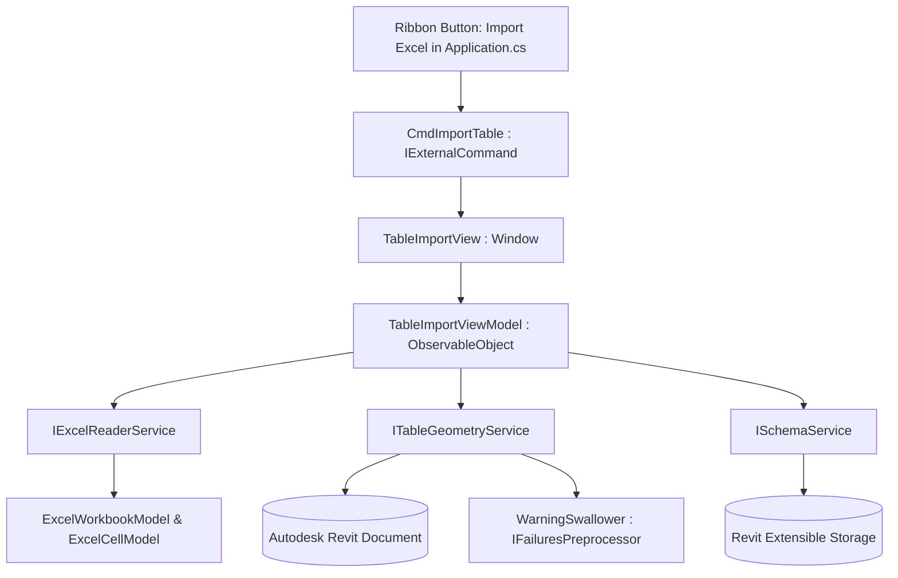

# Technical Plan: 001 — Core Excel Vector Table Import

**Spec ID:** `001-excel-vector-import`  
**Target Add-in:** `TablePlus`  
**Feature Branch:** `TablePlus`  
**Architect:** SDD Architect  
**Status:** DRAFT FOR USER REVIEW (PHASE GATE 3)  
**Date:** 2026-09-22  
**Language:** English (Official Engineering Standard)  

---

## 1. Architectural Overview & Component Diagram

The architecture strictly decouples Revit API dependencies from the presentation layer and file parsing routines. The user interface runs as a modal dialog invoked by a standard Revit external command.



---

## 2. Project & Solution Structure

The new add-in `TablePlus` will be structured in the repository as follows:

```text
TablePlus/
├── TablePlus.addin             # Revit registration manifest
├── TablePlus.csproj            # Multi-targeted .NET project (Nice3point Revit Toolkit)
├── Application.cs              # IExternalApplication (Ribbon UI registration)
├── Commands/
│   └── CmdImportTable.cs       # IExternalCommand entry point
├── Models/
│   ├── ExcelWorkbookModel.cs   # Workbook structure & sheets list
│   ├── ExcelCellModel.cs       # Cell value, format, font, border, background RGB
│   ├── MergedCellRange.cs      # Bounding coordinates for merged cells
│   └── TableImportConfig.cs    # User configuration (view type, name, scale)
├── Services/
│   ├── IExcelReaderService.cs  # Pure Excel parsing contract
│   ├── ExcelReaderService.cs   # Managed OpenXML / ClosedXML reader implementation
│   ├── ITableGeometryService.cs# Revit API vector view generation contract
│   ├── TableGeometryService.cs # DetailCurve, TextNote & FilledRegion engine
│   ├── ISchemaService.cs       # Extensible Storage contract
│   └── SchemaService.cs        # TablePlus metadata persistence
├── ViewModels/
│   └── TableImportViewModel.cs # Presentation logic (CommunityToolkit.Mvvm)
├── Views/
│   └── TableImportView.xaml    # WPF Window (FilterPlus modern card-based theme)
└── Resources/
    ├── Icons/                  # 16x16 and 32x32 Ribbon icons
    └── Assets/                 # UI assets
```

---

## 3. Layer Specifications & Contracts

### 3.1. Models (`/Models/`)
Pure C# classes completely free of references to Revit API types:

```csharp
public class ExcelCellModel
{
    public int RowIndex { get; set; }
    public int ColumnIndex { get; set; }
    public string FormattedValue { get; set; } = string.Empty;
    public double WidthMillimeters { get; set; }
    public double HeightMillimeters { get; set; }
    public string FontFamily { get; set; } = "Arial";
    public double FontSizePoints { get; set; } = 10.0;
    public bool IsBold { get; set; }
    public bool IsItalic { get; set; }
    public HorizontalAlignment HorizontalAlign { get; set; }
    public VerticalAlignment VerticalAlign { get; set; }
    public string? BackgroundColorHex { get; set; } // e.g., "#E0E0E0"
    public CellBorderBorders Borders { get; set; } = new();
}

public class MergedCellRange
{
    public int StartRow { get; set; }
    public int EndRow { get; set; }
    public int StartCol { get; set; }
    public int EndCol { get; set; }
}
```

### 3.2. Services (`/Services/`)

#### A. `IExcelReaderService`
Reads `.xlsx` / `.xls` without requiring Microsoft Excel installed:
```csharp
public interface IExcelReaderService
{
    ExcelWorkbookModel InspectWorkbook(string filePath);
    IList<ExcelCellModel> ExtractCells(string filePath, string sheetName, string? cellRange);
    IList<MergedCellRange> ExtractMergedCells(string filePath, string sheetName);
}
```

#### B. `ITableGeometryService`
Generates native Revit 2D elements within the active document:
```csharp
public interface ITableGeometryService
{
    View GenerateTable(
        Document doc, 
        TableImportConfig config, 
        IList<ExcelCellModel> cells, 
        IList<MergedCellRange> mergedRanges);
}
```

Implementation details for `TableGeometryService`:
- **View Creation**:
  - Drafting View: `ViewDrafting.Create(doc, draftingViewFamilyTypeId)`.
  - Legend View: Uses `ViewFamilyType` of `ViewFamily.Legend` or duplicates a base legend.
- **Coordinates & Scale**:
  - Converts cell dimensions from millimeters to feet: `valFeet = valMm / 304.8`.
  - Applies target view scale factor.
- **Detail Lines**:
  - Instantiates `doc.Create.NewDetailCurve(view, Line.CreateBound(ptA, ptB))`.
  - Assigns `<Thin Lines>` or custom line style graphics.
- **Text Notes**:
  - Computes inner cell margin and instantiates `TextNote.Create(doc, view.Id, ptCenter, text, textOptions)`.
- **Filled Regions (Cell Shading)**:
  - Where `BackgroundColorHex` is present, constructs `CurveLoop` bounding the cell and instantiates `FilledRegion.Create(doc, solidFillTypeId, view.Id, new List<CurveLoop> { loop })`.
  - Overrides color using `view.SetElementOverrides(region.Id, overrideGraphicSettings)`.
- **Failures Preprocessor**:
  - Uses `WarningSwallower` to eliminate Revit popups during batch creation.

#### C. `ISchemaService` (Extensible Storage)
```csharp
public interface ISchemaService
{
    void StampTableMetadata(View view, TableImportConfig config, string sourceFilePath);
    TableImportConfig? ReadTableMetadata(View view);
}
```
Schema GUID: `E3B21D40-6C9A-4E2F-8A11-92D0543B7A1C` (`TablePlus_TableData`).

### 3.3. Presentation Layer (`/Views/` & `/ViewModels/`)

#### `TableImportView.xaml`
- Designed under the **FilterPlus card-based theme**:
  - Header with title and active theme badge.
  - Card 1: **Source File Selection** (File path text box, Browse button, Drag & Drop area).
  - Card 2: **Worksheet & Range Picker** (Virtualized ComboBox of sheets, radio buttons for *Whole Sheet*, *Named Range*, *Custom Range `A1:G25`*).
  - Card 3: **Target View Settings** (View Name input with auto-suggest, View Type radio buttons: *Drafting View* vs *Legend View*, Scale ComboBox: 1:1, 1:10, 1:20, 1:50, 1:100).
  - Bottom Action Bar: Cancel button, Import Table button, and determinate ProgressBar during parsing/generation.
- **Inline Resources**: All styles, brushes, converters, and templates declared in `<Window.Resources>`.

#### `TableImportViewModel.cs`
- Powered by `CommunityToolkit.Mvvm`:
  - `[ObservableProperty] string filePath;`
  - `[ObservableProperty] ObservableCollection<string> worksheets;`
  - `[ObservableProperty] string selectedWorksheet;`
  - `[ObservableProperty] string customRangeText = "A1:G20";`
  - `[ObservableProperty] bool isLegendView;`
  - `[ObservableProperty] string viewName;`
  - `[ObservableProperty] bool isBusy;`
  - `[RelayCommand] Task BrowseFileAsync();`
  - `[RelayCommand] Task ImportTableAsync();`

### 3.4. Command & Ribbon Integration

#### `Application.cs` (`IExternalApplication`)
Registers the Ribbon button on Revit startup:
- Tab: `DBDev Tools` (or standard `Add-Ins` if tab exists).
- Panel: `Tables`.
- PushButton: `Import Excel` (`TablePlus.Commands.CmdImportTable`).
- Large Image: `pack://application:,,,/TablePlus;component/Resources/Icons/TablePlus_32.png`.
- Small Image: `pack://application:,,,/TablePlus;component/Resources/Icons/TablePlus_16.png`.
- Registers `AppDomain.CurrentDomain.AssemblyResolve` in `OnStartup()`.

#### `CmdImportTable.cs` (`IExternalCommand`)
```csharp
[Transaction(TransactionMode.Manual)]
public class CmdImportTable : IExternalCommand
{
    public Result Execute(ExternalCommandData commandData, ref string message, ElementSet elements)
    {
        UIApplication uiApp = commandData.Application;
        UIDocument uiDoc = uiApp.ActiveUIDocument;
        Document doc = uiDoc.Document;

        if (doc.IsFamilyDocument || doc.IsReadOnly)
        {
            TaskDialog.Show("TablePlus", "TablePlus can only run in editable project (.rvt) documents.");
            return Result.Cancelled;
        }

        // Initialize Services & ViewModel
        var excelService = new ExcelReaderService();
        var geometryService = new TableGeometryService();
        var schemaService = new SchemaService();
        var viewModel = new TableImportViewModel(doc, excelService, geometryService, schemaService);

        var view = new TableImportView(viewModel);
        view.ShowDialog();

        return Result.Succeeded;
    }
}
```

---

## 4. Multi-Version Compatibility & Autoloader

- Target Frameworks: `.NET 8.0` (Revit 2025–2027) and `.NET Framework 4.8` (Revit 2023–2024).
- `TablePlus.addin` manifest properly registered:
```xml
<?xml version="1.0" encoding="utf-8"?>
<RevitAddIns>
  <AddIn Type="Application">
    <Name>TablePlus</Name>
    <Assembly>TablePlus/TablePlus.dll</Assembly>
    <AddInId>C9281744-8B1A-4C23-9D01-B719E022F3AA</AddInId>
    <FullClassName>TablePlus.Application</FullClassName>
    <VendorId>DBDev</VendorId>
    <VendorDescription>DBDev Solutions</VendorDescription>
  </AddIn>
</RevitAddIns>
```

---

## 5. Security & Failure Preprocessing

- Path validation via `Path.GetFullPath` and anti-traversal sanitization before file streams are opened.
- Registration of `WarningSwallower` to suppress overlapping line warnings without corrupting the document.
