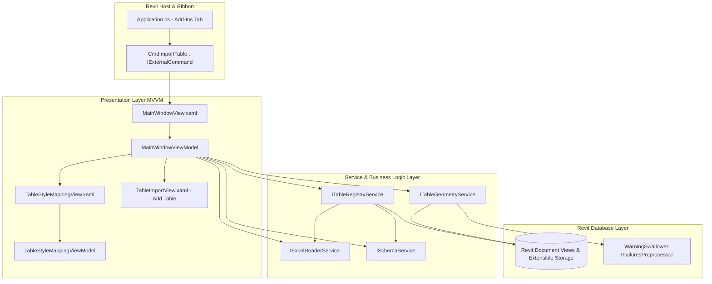

# Technical Plan: Master Table Dashboard & Table Manager UI

**Spec ID:** `002`  
**Target Add-in:** `TablePlus`  
**Status:** DRAFT (Ready for User Validation)  
**Author / Architect:** SDD Polyglot Architect  
**Date:** 2026-09-23  

---

## 1. Architectural Overview & Component Diagram

This technical plan details the architecture for the **Master Table Dashboard & Table Manager** in TablePlus. The architecture strictly separates business logic, data models, Revit API database transactions, and modern WPF presentation logic.



---

## 2. Layer Definitions & Contracts

### 2.1. Models & DTOs (`TablePlus/Models/`)

#### [NEW] `TableItemModel.cs`
Pure observable presentation model representing a single table entry in the Master DataGrid.
```csharp
namespace TablePlus.Models;

public partial class TableItemModel : ObservableObject
{
    [ObservableProperty] private bool isSelected;
    [ObservableProperty] private TableSourceType sourceType = TableSourceType.ExcelXlsx;
    [ObservableProperty] private TableSyncStatus status = TableSyncStatus.UpToDate;
    [ObservableProperty] private string statusTooltip = "Table is synchronized with source file.";

    [ObservableProperty] private long viewId;
    [ObservableProperty] private string viewName = string.Empty;
    [ObservableProperty] private TargetViewType viewType = TargetViewType.DraftingView;
    [ObservableProperty] private int viewScale = 1;

    [ObservableProperty] private string sourceFilePath = string.Empty;
    [ObservableProperty] private string sourceFileName = string.Empty;
    [ObservableProperty] private string selectedSheetName = string.Empty;
    [ObservableProperty] private string cellRangeAddress = string.Empty;

    [ObservableProperty] private ObservableCollection<string> availableSheets = new();

    [ObservableProperty] private bool isAutoSyncEnabled;
    [ObservableProperty] private bool isBlackAndWhite;

    [ObservableProperty] private TableImportConfig config = new();
}
```

#### [NEW] `TableEnums.cs`
Extended enums for status and source type:
```csharp
namespace TablePlus.Models;

public enum TableSyncStatus
{
    UpToDate,        // 🟢 File timestamp <= LastImportedTimestamp
    Modified,        // 🟠 File timestamp > LastImportedTimestamp
    FileNotFound,    // 🔴 File does not exist or inaccessible
    Unlinked         // ⚪ View exists but source path was detached
}

public enum TableSourceType
{
    ExcelXlsx,
    ExcelXlsm,
    Csv,
    // Prepared for future specs
    PdfDocument,
    WordDocument,
    ScheduleView
}
```

#### [MODIFY] `TableImportConfig.cs`
Extend the existing model to persist styling and automation parameters:
```csharp
public class TableImportConfig
{
    // Existing Spec 001 properties...
    public string SourceFilePath { get; set; } = string.Empty;
    public string SelectedSheetName { get; set; } = string.Empty;
    public CellRangeSelectionMode RangeMode { get; set; } = CellRangeSelectionMode.EntireSheet;
    public string? CustomRangeAddress { get; set; }
    public string? SelectedNamedRange { get; set; }
    public TargetViewType TargetViewType { get; set; } = TargetViewType.DraftingView;
    public string ViewName { get; set; } = string.Empty;
    public int ViewScale { get; set; } = 1;
    public bool PreserveBackgroundFills { get; set; } = true;
    public bool BlackAndWhiteMode { get; set; } = false;
    public string FallbackFontFamily { get; set; } = "Arial";
    public double DefaultFontSizePoints { get; set; } = 8.0;
    public string? LastImportedTimestampUtc { get; set; }

    // Spec 002 additions:
    public bool IsAutoSyncEnabled { get; set; } = false;
    public TableSourceType SourceType { get; set; } = TableSourceType.ExcelXlsx;
    public string? GridLineStyleName { get; set; }
    public string? BodyTextNoteTypeName { get; set; }

    // Header Row Overrides
    public bool HeaderCustomStyleEnabled { get; set; } = false;
    public string? HeaderTextNoteTypeName { get; set; }
    public string? HeaderTextColorHex { get; set; }
    public string? HeaderFillColorHex { get; set; }
}
```

---

### 2.2. Service Interfaces & Contracts (`TablePlus/Services/`)

#### [NEW] `ITableRegistryService.cs` & `TableRegistryService.cs`
Discovers and manages existing TablePlus tables within the active Revit Document.
```csharp
namespace TablePlus.Services;

public interface ITableRegistryService
{
    /// <summary>
    /// Scans the Revit Document for all Drafting and Legend views stamped with TablePlus metadata,
    /// verifies disk file timestamps, and returns populated TableItemModels.
    /// </summary>
    Task<IList<TableItemModel>> DiscoverTablesAsync(Document doc);

    /// <summary>
    /// Refreshes the status and available worksheets for a specific table item.
    /// </summary>
    Task RefreshItemStatusAsync(TableItemModel item);

    /// <summary>
    /// Deletes or unlinks the specified table views from the Revit database.
    /// </summary>
    bool DeleteOrUnlinkTable(Document doc, TableItemModel item, bool deleteView);
}
```

#### [MODIFY] `ITableGeometryService.cs` & `TableGeometryService.cs`
Enhanced to support:
1. Lookup and assignment of custom `GraphicsStyle` line styles (`GridLineStyleName`).
2. Custom `TextNoteType` lookup and creation for body cells and header rows.
3. Header row fill color overrides (`HeaderFillColorHex`) and text color overrides (`HeaderTextColorHex`).
4. Strict `BlackAndWhiteMode` execution (suppressing background filled regions, forcing RGB 0,0,0).

#### [MODIFY] `ISchemaService.cs` & `SchemaService.cs`
No GUID or schema alterations needed. The schema already stores `ConfigJson` (simple string field), which cleanly absorbs all new `TableImportConfig` properties without modifying Revit's registered Extensible Storage fields.

---

### 2.3. Presentation Layer: ViewModels (`TablePlus/ViewModels/`)

#### [NEW] `MainWindowViewModel.cs`
The master ViewModel powering `MainWindowView.xaml`:
- **Collections:**
  - `ObservableCollection<TableItemModel> Tables`: All discovered tables.
  - `ICollectionView FilteredTables`: Filtered view based on `SearchText`, `SelectedViewTypeFilter`, and `SelectedStatusFilter`.
- **Observable Properties:**
  - `string SearchText`: Live filter string.
  - `string SelectedViewTypeFilter`: "All", "Drafting Views", "Legend Views".
  - `string SelectedStatusFilter`: "All", "Up to Date", "Modified", "File Not Found".
  - `TableItemModel? SelectedTable`: Active single selection.
  - `bool IsSelectAllChecked`: Controls master checkbox state.
  - `int TotalCount`, `int SelectedCount`, `int OutOfDateCount`.
  - `bool IsBusy`, `string BusyStatusMessage`, `double ProgressValue`.
- **Relay Commands:**
  - `[RelayCommand] Task RefreshInventoryAsync()`
  - `[RelayCommand] Task AddTableAsync()` (Opens existing `TableImportView` modal; appends result to `Tables`)
  - `[RelayCommand] Task SyncSelectedAsync()` (Executes batch sync on checked rows)
  - `[RelayCommand] void OpenSelectedView()` (Activates view in active UIDocument)
  - `[RelayCommand] Task DeleteSelectedAsync()` (Prompts user and executes deletion/unlinking)
  - `[RelayCommand] void OpenDesignWindow(TableItemModel item)` (Opens `TableStyleMappingView`)
  - `[RelayCommand] Task OnSheetChangedAsync(TableItemModel item)` (Reconfigures range and triggers sync)

#### [NEW] `TableStyleMappingViewModel.cs`
The ViewModel powering `TableStyleMappingView.xaml`:
- **Properties:**
  - `ObservableCollection<string> AvailableLineStyles`: Populated from Revit document line subcategories.
  - `ObservableCollection<string> AvailableTextStyles`: Populated from Revit document `TextNoteType` elements.
  - `string? SelectedGridLineStyle`
  - `string? SelectedBodyTextStyle`
  - `bool HeaderCustomStyleEnabled`
  - `string? SelectedHeaderTextStyle`
  - `string HeaderTextColorHex`
  - `string HeaderFillColorHex`
  - `ObservableCollection<string> PresetColors`: Standard architectural palette (Navy, Charcoal, Teal, Light Grey, Warm Beige, White).
- **Commands:**
  - `[RelayCommand] void Save(Window window)`
  - `[RelayCommand] void Cancel(Window window)`

---

### 2.4. Presentation Layer: Views (`TablePlus/Views/`)

#### [NEW] `MainWindowView.xaml`
- **Root Element:** `<Window>` with FilterPlus dark/light Fluent style system.
- **Resource Scoping Rule:** All converters, button styles, templates, card borders, and brush resources defined strictly inline inside `<Window.Resources>`. No external `pack://application:,,,/` ResourceDictionary imports (prevents Revit `XamlParseException`).
- **Layout Architecture:**
  - **Grid Row 0 (Header):** Add-in branding, title badge ("TablePlus Master Dashboard"), and status counter.
  - **Grid Row 1 (Control Cards):**
    - *Card 1 (Actions):* Buttons `+ Add Table`, `🔄 Sync Selected`, `👁️ Open View`, `🗑️ Delete / Unlink`. Buttons enable/disable dynamically based on row selection.
    - *Card 2 (Filters):* TextBox with search watermark, ComboBox for View Type, ComboBox for Status.
    - *Card 3 (Global Tools):* `Default Styles`, `About`.
  - **Grid Row 2 (DataGrid):**
    - Virtualized DataGrid: `VirtualizingStackPanel.IsVirtualizing="True"`, `VirtualizingStackPanel.VirtualizationMode="Recycling"`, `ScrollViewer.CanContentScroll="True"`.
    - Columns:
      1. Checkbox column (`IsSelected`) with master header checkbox.
      2. Source Icon column (Excel icon).
      3. Status badge (🟢, 🟠, 🔴) with tooltip.
      4. Revit View Name.
      5. View Type badge.
      6. View Scale.
      7. Source File Name (with full path tooltip).
      8. Worksheet / Range ComboBox.
      9. Auto-Sync Checkbox (`IsAutoSyncEnabled`).
      10. Black & White Checkbox (`IsBlackAndWhite`).
      11. Design Button (`[ 🎨 Design... ]`).
  - **Grid Row 3 (Footer):** Summary indicators ("3 tables | 1 selected | 1 out of date"), progress bar, and buttons `Close` / `Sync Selected`.

#### [NEW] `TableStyleMappingView.xaml`
- Modal dialog opened when clicking `[ 🎨 Design... ]` on a table row.
- Inline FilterPlus card layout:
  - *Card 1 (Borders & Gridlines):* Line style selector for interior grid and outer table boundary.
  - *Card 2 (Body Cell Typography):* Text note type selector.
  - *Card 3 (Header Row Overrides):* Toggle switch, header text note type selector, text color picker, and background shading color picker.
  - *Footer:* `Save & Apply` and `Cancel` buttons.

---

### 2.5. Command & Ribbon Layer (`TablePlus/Commands/` & `Application.cs`)

#### [MODIFY] `TablePlus/Commands/CmdImportTable.cs`
Updated to serve as the unified entry point:
```csharp
[Transaction(TransactionMode.Manual)]
public class CmdImportTable : IExternalCommand
{
    public Result Execute(ExternalCommandData commandData, ref string message, ElementSet elements)
    {
        var uiApp = commandData.Application;
        var doc = uiApp.ActiveUIDocument?.Document;
        if (doc == null) return Result.Cancelled;

        if (doc.IsFamilyDocument)
        {
            TaskDialog.Show("TablePlus", "TablePlus operates only within Revit Project documents (.rvt).");
            return Result.Cancelled;
        }

        var viewModel = new MainWindowViewModel(uiApp, doc);
        var view = new MainWindowView(viewModel);

        if (uiApp.MainWindowHandle != IntPtr.Zero)
        {
            new WindowInteropHelper(view).Owner = uiApp.MainWindowHandle;
        }

        view.ShowDialog();
        return Result.Succeeded;
    }
}
```

---

## 3. Transaction & Failure Handling Architecture

1. **Batch Synchronization Granularity:**
   - Multi-table sync operations are enclosed in a `TransactionGroup`:
   ```csharp
   using (var tg = new TransactionGroup(doc, "TablePlus Batch Sync"))
   {
       tg.Start();
       foreach (var table in selectedTables)
       {
           using (var tx = new Transaction(doc, $"Sync Table: {table.ViewName}"))
           {
               var failureOptions = tx.GetFailureHandlingOptions();
               failureOptions.SetFailuresPreprocessor(new WarningSwallower());
               tx.SetFailureHandlingOptions(failureOptions);

               tx.Start();
               try
               {
                   // Re-read spreadsheet and regenerate table geometry
                   geometryService.UpdateTableInView(doc, view, table.Config);
                   schemaService.StampTableMetadata(view, table.Config, table.SourceFilePath);
                   tx.Commit();
               }
               catch (Exception ex)
               {
                   tx.RollBack();
                   LoggerService.LogError($"Failed to sync table {table.ViewName}", ex);
               }
           }
       }
       tg.Assimilate();
   }
   ```
2. **Warning Suppression:**
   - All transactions register `WarningSwallower` (`IFailuresPreprocessor`), ensuring benign Revit line overlap warnings or font substitution notices never display modal popups.

---

## 4. Multi-Version & Runtime Compatibility

- **.NET Framework 4.8 (Revit 2024)** and **.NET 8.0 (Revit 2025, 2026, 2027)**:
  - Multi-version conditionals:
  ```csharp
  #if REVIT2024_OR_GREATER
      long viewIdVal = view.Id.Value;
  #else
      long viewIdVal = view.Id.IntegerValue;
  #endif
  ```
- **Assembly Resolve Hook:**
  - Preserved in `Application.OnStartup()` to ensure ClosedXML, DocumentFormat.OpenXml, and CommunityToolkit dependencies load seamlessly in .NET 8 isolated ALCs.

---

## 5. Security & Zero-Trust Verification

- **Path Sanitization:** Source file paths checked using `Path.GetFullPath()` and sanitized against Directory Traversal (`../`).
- **Safe Deserialization:** `JsonSerializerOptions` in `SchemaService` configured with strict types and no arbitrary type instantiation.
- **Fail-safe File Access:** All Excel read operations open files with `FileShare.ReadWrite` to allow reading workbooks currently open in Microsoft Excel without file locking conflicts.
- **Transaction Safety:** 100% of Revit API mutations wrapped in `using` statements with automatic rollback on exception.

---

## 6. Implementation Verification Plan

### 6.1. Build & Compilation Verification
- Build all 4 Release configurations and Debug:
  - `dotnet build TablePlus\TablePlus.csproj -c Release.R24 /p:DeployAddin=false`
  - `dotnet build TablePlus\TablePlus.csproj -c Release.R25 /p:DeployAddin=false`
  - `dotnet build TablePlus\TablePlus.csproj -c Release.R26 /p:DeployAddin=false`
  - `dotnet build TablePlus\TablePlus.csproj -c Release.R27 /p:DeployAddin=false`
  - `dotnet build TablePlus\TablePlus.csproj -c Debug.R24 /p:DeployAddin=false`

### 6.2. App Store Bundle Verification
- Run `build-bundle.ps1` targeting 2024–2027 to verify bundle packaging into `Deploy/` and `TablePlusPublishPackage/`.

### 6.3. Functional UI & Revit API Clinical Verification
1. Launch Revit with TablePlus installed.
2. Click **Import Excel** in the **Add-Ins (Complementos)** tab. Verify `MainWindowView` opens with top cards and empty grid (if no tables exist).
3. Click `+ Add Table / Import`, select a test `.xlsx` file, and create a Drafting View table.
4. Verify the newly created table appears immediately in the Master DataGrid with 🟢 Up to Date status.
5. Select the row and click `👁️ Open View` in the top action card; verify Revit activates and focuses that drafting view.
6. Modify the Excel file externally and save it. Click `Refresh` or reopen TablePlus; verify the status turns to 🟠 Externally Modified.
7. Click `[ 🎨 Design... ]` on the row; verify `TableStyleMappingView` opens with line styles, body text styles, and header row customization options.
8. Check "Black & White" or change Header style, click `Sync Selected`, and verify the view reflects the new styling without changing the ViewId.
