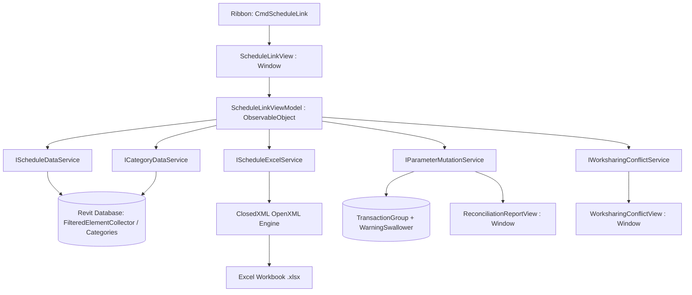

# Technical Plan: Bidirectional Schedule Data Exchange (Spec 003)

**Spec ID:** `003`  
**Target Add-in:** `TablePlus`  
**Status:** DRAFT (Phase Gate 3: Ready for User Validation)  
**Author / Architect:** SDD Polyglot Architect  
**Date:** 2026-09-24  

---

## 1. Architectural Overview & Component Diagram

The **Bidirectional Schedule Data Exchange** (`Schedule Link`) subsystem expands TablePlus into a bidirectional data bridge between Autodesk Revit's element database and Microsoft Excel spreadsheets.



---

## 2. Layer Definitions & Contracts

### 2.1. Models & DTOs (`TablePlus/Models/ScheduleLink/`)

Pure DTOs completely decoupled from UI controls and long-lived Revit API pointers:

```csharp
namespace TablePlus.Models.ScheduleLink;

public enum ExtractionMode
{
    Schedules,
    Categories
}

public enum ParameterScope
{
    Instance,
    Type,
    ReadOnly
}

public class ScheduleDefinitionItem
{
    public long ViewId { get; init; }
    public string Name { get; init; } = string.Empty;
    public string CategoryName { get; init; } = string.Empty;
    public int FieldCount { get; init; }
    public bool IsSelected { get; set; }
}

public class CategoryDefinitionItem
{
    public long CategoryId { get; init; }
    public string CategoryName { get; init; } = string.Empty;
    public int ElementCount { get; init; }
    public bool IsSelected { get; set; }
}

public class ParameterDefinitionItem
{
    public string Name { get; init; } = string.Empty;
    public ParameterScope Scope { get; init; }
    public StorageType StorageType { get; init; }
    public string ForgeTypeId { get; init; } = string.Empty;
    public string UnitLabel { get; init; } = string.Empty;
    public bool IsReadOnly { get; init; }
    public bool IsSelected { get; set; } = true;
}

public class ScheduleRowData
{
    public long ElementId { get; init; }
    public string UniqueId { get; init; } = string.Empty;
    public long? TypeId { get; init; }
    public Dictionary<string, string> ParameterValues { get; } = new(StringComparer.OrdinalIgnoreCase);
}

public class ScheduleTablePayload
{
    public string TableName { get; init; } = string.Empty;
    public ExtractionMode Mode { get; init; }
    public List<ParameterDefinitionItem> Columns { get; } = [];
    public List<ScheduleRowData> Rows { get; } = [];
}

public class WorksharingConflictItem
{
    public long ElementId { get; init; }
    public string ElementName { get; init; } = string.Empty;
    public string CurrentOwner { get; init; } = string.Empty;
    public string ParameterName { get; init; } = string.Empty;
    public string AttemptedValue { get; init; } = string.Empty;
}

public class ReconciliationReport
{
    public int TotalRows { get; set; }
    public int UpdatedParameters { get; set; }
    public int UnchangedParameters { get; set; }
    public int FailedParameters { get; set; }
    public int SkippedConflicts { get; set; }
    public List<string> ErrorLog { get; } = [];
    public List<WorksharingConflictItem> ConflictLog { get; } = [];
}
```

---

### 2.2. Service Interfaces (`TablePlus/Services/ScheduleLink/`)

```csharp
namespace TablePlus.Services.ScheduleLink;

public interface IScheduleDataService
{
    IList<ScheduleDefinitionItem> GetProjectSchedules(Document doc);
    ScheduleTablePayload ExtractScheduleData(Document doc, long viewScheduleId, IList<ParameterDefinitionItem> selectedParams);
    IList<ParameterDefinitionItem> GetScheduleParameters(Document doc, long viewScheduleId);
}

public interface ICategoryDataService
{
    IList<CategoryDefinitionItem> GetModelCategories(Document doc);
    IList<ParameterDefinitionItem> GetCategoryParameters(Document doc, long categoryId);
    ScheduleTablePayload ExtractCategoryData(Document doc, long categoryId, IList<ParameterDefinitionItem> selectedParams);
}

public interface IScheduleExcelService
{
    void ExportToExcel(ScheduleTablePayload payload, string filePath, Document doc);
    ScheduleTablePayload ReadFromExcel(string filePath);
}

public interface IWorksharingConflictService
{
    IList<WorksharingConflictItem> DetectConflicts(Document doc, ScheduleTablePayload payload);
}

public interface IParameterMutationService
{
    ReconciliationReport ApplyMutations(
        Document doc,
        ScheduleTablePayload importPayload,
        bool skipWorksharingConflicts,
        Action<int, int>? progressCallback = null);
}
```

---

### 2.3. Presentation Layer & ViewModels (`TablePlus/ViewModels/ScheduleLink/`)

- `ScheduleLinkViewModel.cs`:
  - Observable properties: `SelectedMode` (Schedules vs Categories), `SearchQuery`, `SelectedSchedule`, `SelectedCategory`, `IsExporting`, `IsImporting`, `ProgressPercentage`, `StatusMessage`.
  - Collections: `ObservableCollection<ScheduleDefinitionItem> Schedules`, `ObservableCollection<CategoryDefinitionItem> Categories`, `ObservableCollection<ParameterDefinitionItem> Parameters`.
  - Commands: `ExportCommand`, `ImportCommand`, `SelectAllParametersCommand`, `DeselectAllParametersCommand`, `RefreshCommand`.
- `WorksharingConflictViewModel.cs`:
  - Displays list of conflicting items with current owner names.
  - Commands: `ProceedAndReportCommand`, `RollbackAndCancelCommand`.
- `ReconciliationReportViewModel.cs`:
  - Displays stat badges, error logs, and allows saving a detailed diagnostic `.txt` report.

---

### 2.4. WPF User Interface & FilterPlus Design System (`TablePlus/Views/ScheduleLink/`)

- **Inline XAML Architecture**: Zero external `pack://` references. All brushes, converters, styles, and templates declared in `<Window.Resources>`.
- **Card-Based Visual Layout**:
  - **Upper Card**: Extraction Mode Selector (Tab switches: 📅 *Revit Schedules* vs. 🏷️ *Model Categories*) + Live Search Bar.
  - **Main Split Area**:
    - **Left Card (Width 360px)**: Virtualized ListView of Schedules or Categories with item counters and selection highlights.
    - **Right Card (Flexible)**: Searchable DataGrid/ListView of parameters with columns: Checkbox, Parameter Name, Scope Badge (`[INST]`, `[TYPE]`, `[READ-ONLY]`), Data Type, and Project Units.
  - **Bottom Card**: Path display, progress bar, `[ Select All ]`, `[ Deselect All ]`, `[ 📤 Export to Excel ]`, and `[ 📥 Import from Excel ]`.
- **Conflict & Report Dialogs**:
  - `WorksharingConflictView.xaml`: Fluent alert banner, table of conflicts, and distinct option buttons.
  - `ReconciliationReportView.xaml`: Metric stat cards (Updated, Unchanged, Errors, Skipped) with expander for detailed logs.

---

## 3. Excel Formatting & ClosedXML Architecture

1. **Locked Technical Headers**:
   - Column `A` (`ElementId`): Hidden or styled with `#64748B` header and light gray fill `#F1F5F9`.
   - Column `B` (`UniqueId`): Hidden or locked for database key fidelity.
2. **Type Parameter Visual Identity**:
   - Header fill: Lavender `#EDE9FE` with deep violet text `#5B21B6`.
   - Header title: `[TYPE] ParameterName`.
   - Excel Cell Comment: `"Editing this Type Parameter will automatically update all instances sharing this Family Symbol."`
3. **Read-Only Visual Identity**:
   - Header fill: Gray `#E2E8F0` with text `#64748B`.
   - Header title: `[READ-ONLY] ParameterName`.
4. **Instance Parameter Visual Identity**:
   - Header fill: Slate/White `#FFFFFF` with primary border `#CBD5E1`.
5. **Unit Formatting**:
   - Cells are formatted according to their Revit project units (`UnitFormatUtils.Format`).

---

## 4. Transaction Safety, Worksharing & Rollback Invariants

```csharp
using (TransactionGroup tg = new TransactionGroup(doc, "TablePlus Schedule Data Sync"))
{
    tg.Start();
    
    // 1. Detect worksharing conflicts
    if (doc.IsWorkshared)
    {
        var conflicts = _conflictService.DetectConflicts(doc, payload);
        if (conflicts.Count > 0)
        {
            var userDecision = ShowConflictDialog(conflicts);
            if (userDecision == ConflictAction.RollbackAndAbort)
            {
                tg.RollBack();
                return ReconciliationReport.Aborted(conflicts);
            }
        }
    }

    // 2. Perform parameter mutations in a scoped transaction with WarningSwallower
    using (Transaction tx = new Transaction(doc, "Apply Parameter Changes"))
    {
        var failureOpts = tx.GetFailureHandlingOptions();
        failureOpts.SetFailuresPreprocessor(new WarningSwallower());
        tx.SetFailureHandlingOptions(failureOpts);
        
        tx.Start();
        
        // Mutate parameters element by element
        // Collect metrics: updated, skipped, failed
        
        tx.Commit();
    }
    
    tg.Assimilate();
    return report;
}
```

---

## 5. Security & Multi-Version Hardening

1. **Path Sanitization**: User-selected export and import paths are validated with `Path.GetFullPath` and verified to avoid path traversal.
2. **File Lock Trapping**: If the destination Excel file is open in Excel, the add-in catches `IOException` and prompts the user to close Excel or select another filename.
3. **Multi-Version Compilation**:
   - Revit 2024 (.NET Framework 4.8): `ElementId.Value`.
   - Revit 2025–2027 (.NET 8.0/9.0): `ElementId.Value`, `ForgeTypeId` unit specifiers.
