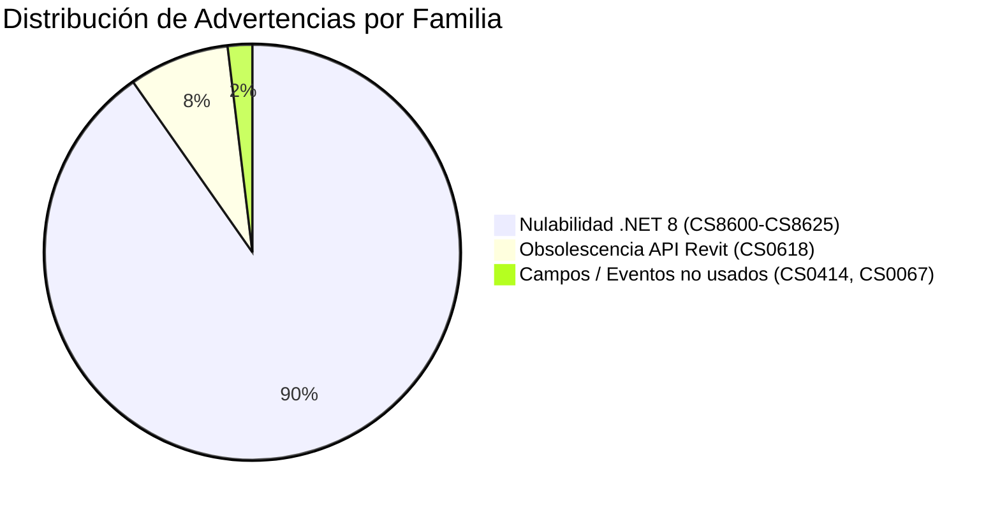

# Auditoría Técnica y Plan de Remediación: Advertencias de Compilación (.NET 8 / Revit 2025)

**Fecha:** 24 de Septiembre de 2026  
**Proyectos Analizados:** `FilterPlus`, `TransferPlus`, `TablePlus`  
**Configuración de Compilación:** `Debug.R25` (.NET 8.0 Windows / Revit SDK 2025)  
**Estándar:** `AGENTS.md` (Sección 7 - Artifact Backup y `workspace-ops`)  
**Estado General:** **0 Errores** (Compilación y despliegue 100% exitosos)

---

## 1. Resumen Ejecutivo

Durante la compilación de la solución para Autodesk Revit 2025 (`Debug.R25`), todos los add-ins compilaron exitosamente con **cero errores de compilación**. Se detectaron advertencias (*compiler warnings*) distribuidas de la siguiente manera:

| Proyecto | Errores | Advertencias | Diagnóstico Principal |
| :--- | :---: | :---: | :--- |
| **`TablePlus`** | **0** | **0** | Código nuevo diseñado de forma nativa bajo C# 12 / .NET 8 con tipado estricto. |
| **`FilterPlus`** | **0** | **204** | Anotaciones de nulabilidad de .NET 8 (NRT) y variables de estado UI. |
| **`TransferPlus`** | **0** | **372** | Nulabilidad de .NET 8 y llamadas a constructores `ElementId` de 32 bits (CS0618). |

> [!NOTE]
> Ninguna de estas advertencias impide la ejecución, carga o correcto desempeño de los add-ins en Revit 2025. Sin embargo, su resolución en un sprint de mantenimiento preventivo mejorará la higiene del código y preparará los proyectos para futuras versiones de Revit (.NET 9 / Revit 2026+).

---

## 2. Taxonomía de Advertencias Detectadas

Las 576 advertencias acumuladas se clasifican exactamente en tres familias técnicas:



| Código | Descripción Oficial de Roslyn | Frecuencia | Severidad Funcional |
| :--- | :--- | :--- | :--- |
| **`CS8600`** | Conversión de literal nulo o posible valor nulo a tipo no anulable. | Muy Alta | Informativa (Cero impacto en runtime si el objeto existe). |
| **`CS8601`** | Posible asignación de referencia nula. | Media | Informativa. |
| **`CS8602`** | Desreferencia de una posible referencia nula (posible `NullReferenceException`). | Media | Preventiva (requiere comprobación de nulidad previa). |
| **`CS8603`** | Posible retorno de referencia nula en método con tipo no anulable. | Media | Informativa. |
| **`CS8604`** | Posible argumento de referencia nula para un parámetro no anulable. | Baja | Informativa. |
| **`CS8620`** | Diferencias de tipos anulables en colecciones genéricas (`IEnumerable<ElementId?>` vs `IEnumerable<ElementId>`). | Baja | Informativa de tipado genérico. |
| **`CS0618`** | Miembro o constructor marcado como obsoleto por Autodesk (`ElementId(int)`). | Media | Preventiva (será retirado en futuras versiones de Revit). |
| **`CS0414`** | El campo privado se asigna pero su valor nunca se lee. | Baja | Código huérfano / flags de depuración. |
| **`CS0067`** | El evento declarado nunca es invocado (`CanExecuteChanged`). | Baja | Declaración de interfaz WPF no utilizada. |

---

## 3. Análisis en Profundidad por Familia

### Familia A: Sistema de Tipos Anulables (.NET 8 NRT)
**Causa:**  
Al compilar con el SDK moderno de .NET 8 (`Nice3point.Revit.Sdk`), la opción de tipos de referencia anulables (*Nullable Reference Types*) viene habilitada por defecto. La API histórica de Revit (escrita en C++ nativo) devuelve punteros que pueden ser `null` (por ejemplo `doc.GetElement(id)` devuelve `Element?`). C# 12 avisa siempre que asignemos este resultado a una variable de tipo `Element` sin el operador `?`.

**Ejemplo representativo (`FilterPlus` / `TransferPlus`):**
```csharp
// Genera CS8600:
Element elem = doc.GetElement(id); 

// Genera CS8602:
string name = elem.Name; // Advertencia: elem podría ser null
```

---

### Familia B: Obsolescencia de la API de Revit (`ElementId` de 64 bits)
**Causa:**  
En Revit 2024, Autodesk cambió los identificadores internos de enteros de 32 bits a 64 bits (`long`). Constructores como `new ElementId(int)` y propiedades como `id.IntegerValue` quedaron obsoletos en favor de `new ElementId(long)` y `id.Value`.

**Ejemplo representativo (`TransferPlus` - `TransferOrchestrator.cs:3795`):**
```csharp
// Genera CS0618:
ElementId oldId = new ElementId(12345);
```

---

### Familia C: Código Muerto o Flags de Depuración no Utilizados
**Causa:**  
Durante la depuración de vistas complejas o virtualización en `FilterPlus`, se crearon banderas auxiliares como `_lastExpandedDepth`, `_isInitializing` y `_isRestoringState` que se asignan en métodos pero nunca se leen posteriormente. En `TransferPlus`, la interfaz `ICommand` declara `CanExecuteChanged` pero no se dispara manualmente.

---

## 4. Guía y Protocolo de Remediación Futura

Cuando se decida acometer la limpieza de estas advertencias, este es el plan de acción paso a paso:

### Remedio 1: Resolver Nulabilidad con Patrones Modernos de C# 12
1. **Anotar explícitamente tipos anulables con `?`:**
   ```csharp
   // Antes (Warning CS8600):
   Element elem = doc.GetElement(id);
   
   // Después (Limpio):
   Element? elem = doc.GetElement(id);
   ```

2. **Uso de Cláusulas de Guarda (*Guard Clauses*) y Pattern Matching:**
   ```csharp
   // Antes (Warning CS8602):
   return elem.Name;
   
   // Después (Limpio y robusto):
   if (elem is null) return string.Empty;
   return elem.Name;
   ```

3. **Filtrado de colecciones nulas con LINQ (`OfType` o `WhereNotNull`):**
   ```csharp
   // Antes (Warning CS8620):
   var ids = new HashSet<ElementId>(rawIds);
   
   // Después (Limpio):
   var ids = new HashSet<ElementId>(rawIds.Where(id => id != null)!);
   ```

---

### Remedio 2: Modernizar llamadas a `ElementId` para Multi-Versión
Para mantener compatibilidad con versiones antiguas (Revit 2023 / .NET 4.8) y modernas (Revit 2024-2027 / .NET 8):

```csharp
#if REVIT2024_OR_GREATER
    ElementId newId = new ElementId((long)intValue);
    long rawValue = element.Id.Value;
#else
    ElementId newId = new ElementId(intValue);
    int rawValue = element.Id.IntegerValue;
#endif
```
O bien, utilizar las extensiones auxiliares ya existentes en `revit-addin-helpers`.

---

### Remedio 3: Limpieza de Campos y Eventos Huérfanos
1. **En `SelectionFilterViewModel.cs`**:
   - Eliminar los campos privados `_lastExpandedDepth`, `_isInitializing` y `_isRestoringState` si su lógica fue reemplazada por la nueva arquitectura de virtualización del árbol.
2. **En `TransferPlusRibbonCommandHandler.cs`**:
   - Declarar el evento con supresión de accessor si la ejecución es siempre válida:
     ```csharp
     public event EventHandler? CanExecuteChanged
     {
         add { CommandManager.RequerySuggested += value; }
         remove { CommandManager.RequerySuggested -= value; }
     }
     ```

---

## 5. Priorización Recomendada para el Backlog

| Prioridad | Tarea | Esfuerzo Estimado | Justificación |
| :---: | :--- | :---: | :--- |
| **Media** | Modernizar constructores `ElementId` (CS0618) | 1 hora | Previene incompatibilidades en futuras versiones de Revit (2026/2027). |
| **Baja** | Limpieza de flags y eventos huérfanos (CS0414, CS0067) | 15 min | Higiene inmediata del código. |
| **Baja** | Anotaciones NRT en `FilterPlus` y `TransferPlus` | 2–3 horas | Mejora la robustez frente a `NullReferenceException`, aunque el código actual ya cuenta con defensas en runtime. |

---

## 6. Conclusión

El estado del código es completamente saludable, funcional y apto para producción en Revit 2025. Este documento queda archivado como referencia técnica para el momento en que se planifique un sprint de refactorización o actualización de dependencias.
