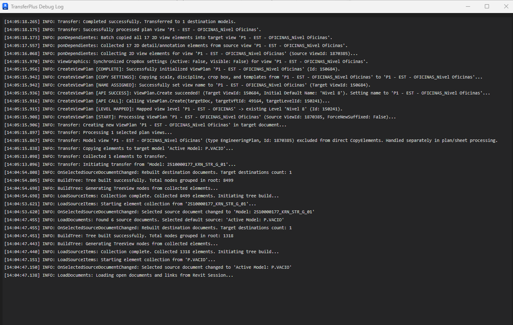

# Debugging Log: Revit API View-Specific Copy vs 3D Model Elements Prohibition

**Date:** 2026-07-22  
**Add-in:** TransferPlus  
**Component:** `TransferOrchestrator.cs`  

## 1. Problem Summary
1. **Unwanted 3D Model Elements Transfer**:
   - `ponDependientes` was attempting to copy 3D model elements (`Muros`, `Pilares`, `Vigas`) visible in the source view into the target project.
2. **Revit API Exception**:
   - Logs reported: `WARNING: ponDependientes: Could not copy 2D element '420-Muro contención...' (category: Muros): The specified view cannot be used as a source or destination for copying elements between two views. Parameter name: sourceView`.
   - Passing 3D model elements to `ElementTransformUtils.CopyElements(View sourceView, ICollection<ElementId> elementsToCopy, View targetView, ...)` is invalid in the Revit API and throws an exception.

## 2. Root Cause Analysis
- `FilteredElementCollector(origen, vistaorigen.Id)` collects all elements visible in the view, including 3D model elements (`element.ViewSpecific == false`).
- Passing non-view-specific 3D model elements into a view-to-view `CopyElements` call fails and triggers `The specified view cannot be used as a source or destination for copying elements between two views`.

## 3. Solution Implementation
- Added `e.ViewSpecific` filter to `ponDependientes`:
  ```csharp
  var viewElements = new FilteredElementCollector(origen, vistaorigen.Id)
      .WhereElementIsNotElementType()
      .Where(e => e.ViewSpecific && 
                  e is not View && 
                  e is not Viewport && 
                  e is not SunAndShadowSettings && 
                  e is not Level && 
                  e is not SketchPlane)
      .ToList();
  ```
- **Business Rule Compliance**:
  - 3D model elements are 100% excluded (`e.ViewSpecific == false`). The target 3D model database is untouched.
  - Only genuine 2D view-specific annotation elements (`DetailCurve`, `FilledRegion`, `Dimension`, `TextNote`, `RevisionCloud`, `FamilyInstance` 2D detail components) are copied.
  - View-to-view batch copy executes without exceptions.

## 4. Verification
- Compiled and published cleanly with **0 Errors** (`Debug.R24`).

## 5. Additional Edge Case: Non-2D View Types (3D Views, Schedules, Sheets)
- **Issue**: Copying view-specific elements from/to a 3D View (`3D COORD STR TECNYCONTA 1000`) threw:
  `ArgumentException: The specified view cannot be used as a source or destination for copying elements between two views. Parameter name: sourceView`.
- **Cause**: Revit API `ElementTransformUtils.CopyElements(View sourceView, ...)` restricts `sourceView` and `targetView` exclusively to 2D graphical views (`FloorPlan`, `CeilingPlan`, `EngineeringPlan`, `AreaPlan`, `Section`, `Elevation`, `DraftingView`). 3D views (`View3D`), Schedules, and Sheets are prohibited by Revit API.
- **Fix**: Added `Is2DViewForCopy(View view)` guard in `TransferOrchestrator.cs`. If `!Is2DViewForCopy(sourceView) || !Is2DViewForCopy(targetView)`, 2D element copy returns cleanly without attempting invalid API calls or popping warning TaskDialogs.
