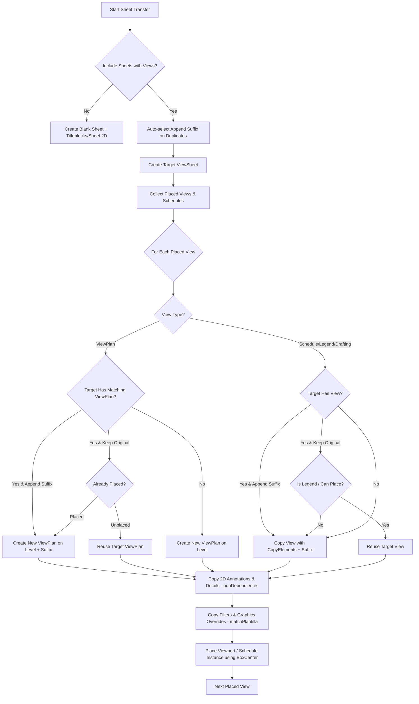

# Implementation Plan - TransferPlus Transfer Logic Matrix & Empty Model Resilience

**Date:** 2026-07-22  
**Add-in:** TransferPlus  
**Component:** `TransferOrchestrator.cs`  

## Problem Summary & Diagnostic Findings

During testing of transferring a Sheet containing a Plan View (`ViewPlan`), a Legend (`Legend`), and a Schedule (`ViewSchedule`) from a source model into an **empty destination model** (no 3D geometry, views, or schedules), the following errors occurred:

1. **Viewport Placement `NullReferenceException`**:
   - **Log**: `ERROR in SheetTransfer: Failed processing view '2243642' on sheet '420': Referencia a objeto no establecida como instancia de un objeto.`
   - **Root Cause**: `TransferOrchestrator.cs` used `srcViewport.get_BoundingBox(sourceSheet)` and `targetViewport.get_BoundingBox(targetSheet)` to compute viewport centers. In empty models (or views without 3D geometry / unregenerated crop boxes), `get_BoundingBox()` returns `null`. Accessing `.Max` or `.Min` on `null` threw a `NullReferenceException`, aborting viewport placement for that view.
   - **Solution**: Use native Revit API property `Viewport.GetBoxCenter()` (and `Viewport.SetBoxCenter()`), which is always available regardless of view geometry state, with a fallback `XYZ` point if bounding boxes are evaluated.

2. **Schedule View Filter Exception**:
   - **Log**: `EXCEPTION in CopyFilters from '420_MED_MUROS ESTRUCTURALES' to '420_MED_MUROS ESTRUCTURALES': The view type does not support View Filters.`
   - **Root Cause**: `CopyFilters` attempted to call `vistaorigen.GetFilters()` on `ViewSchedule` or schedule templates. Schedules do not support view filters.
   - **Solution**: Add `if (!vistaorigen.AreGraphicsOverridesAllowed()) return;` check before querying filters or graphic overrides on non-graphical view types (Schedules, Revision Schedules).

---

## Technical Logic Matrix: Option Combinations & Transfer Behavior

The following matrix documents how `TransferPlus` processes sheet and view transfers based on option card selections and target model conditions:

### Option Interaction Breakdown

| Card / Switch | Selected Option | Transfer Behavior in Empty Target Model | Transfer Behavior in Model with 3D Geometry |
| :--- | :--- | :--- | :--- |
| **On Duplicates** | `Keep Original` (`cf_rbKeepOriginal`) | If level/template exists, reuses it. Creates missing levels/views if target sheet cannot host duplicates. | Reuses matching target views/levels if unplaced; creates duplicate `ViewPlan` if already placed on another sheet. |
| | `Abort Transaction` (`cf_rbAbortTransaction`) | Aborts transaction if name collision occurs. | Same. |
| | `Append Suffix` (`cf_rbAppendSuffix`) | Appends `_Copy` suffix to created sheet, plan views, drafting views, templates, and filters. | Appends suffix and creates independent view clones for the target sheet. |
| **On Views** | `Include Sheets with Views` (`cf_chk_SheetWithViews`) | Programmatically creates target `ViewSheet`, creates target `Level` if missing, creates `ViewPlan`, copies 2D annotations, copies schedules & legends, places viewports using `BoxCenter`. | Same, plus 3D model geometry renders automatically in placed viewports. |
| | `Transfer View Elements` (`cf_chk_ViewElements`) | 2D annotations inside sheet-placed views are **always copied inconditionally**. Sheet canvas 2D items (text notes, lines) are copied if checked. | Same. |
| | `Force Level in Level Base Views` (`cf_chk_ForceLevelInLevelBaseViews`) | Prompts Level Mapping dialog if source levels differ. Creates new level in target with elevation & custom name. | Maps source view level to selected target level or creates new level. |
| | `Callouts` (`cf_chk_Callout`) | Recursively copies linked callout views and dependent detail views. | Same. |
| | `Use Legend if Exists` (`cf_chk_UseLegendIfExists`) | Reuses target legend if present; copies legend if absent. | Reuses existing target legend view on multiple sheets. |
| | `Use Schedule if Exists` (`cf_chk_UseScheduleIfExists`) | Reuses target schedule if present; copies schedule structure if absent. | Reuses existing schedule. In non-empty model, rows populate with target model instances. |
