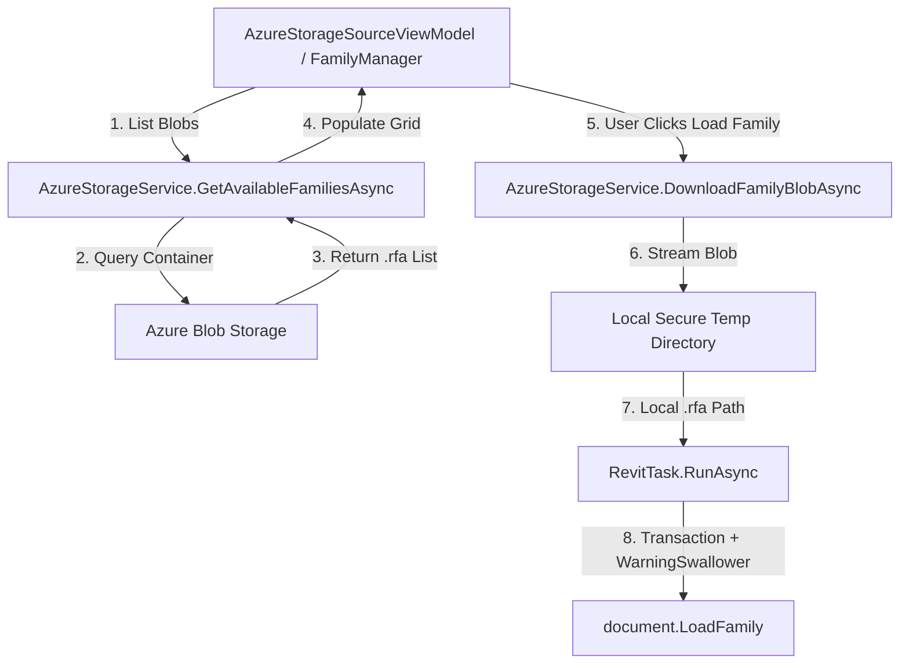

# Implementation Plan — Azure Storage Family Blob Extraction & Async Integration in TransferPlus

## 📅 Registration Date: 2026-08-03
## 🌿 Git Branch: `TransferFamily` (based on `TransferPlus`)

---

## 1. Overview
This plan details the extraction, adaptation, and integration of the **Azure Storage Blob Authentication and Family Download** logic from `references_examples\BimFM\Source\Bim.FamilyManager.Source.AzureStorage` into **TransferPlus**.

The service will be cross-compatible with **.NET Framework 4.8** (Revit 2024 and earlier) and **.NET 8** (Revit 2025+), utilizing `Azure.Storage.Blobs` and secure asynchronous streaming to local temporary storage before invoking Revit's `document.LoadFamily()`.

---

## 2. Technical Architecture & Design

### 2.1. Multi-Target Azure Storage Service (`AzureStorageService.cs`)
- **Package Dependency**: `Azure.Storage.Blobs` (v12.x), compatible with both .NET Framework 4.8 and .NET 8.
- **Key Methods**:
  - `GetAvailableFamiliesAsync(string connectionString, string containerName, string rootPath, CancellationToken cancellationToken)`:
    - Asynchronously lists all `.rfa` family blobs inside the Azure container.
    - Filters out Revit backup files matching `\.\d{4}\.rfa$`.
    - Returns a collection of `AzureFamilyBlobModel` objects containing blob name, family name, file size, and last modified timestamp.
  - `DownloadFamilyBlobAsync(string connectionString, string containerName, string blobName, CancellationToken cancellationToken)`:
    - Asynchronously streams the Azure blob to a local temporary `.rfa` file using `FamilyFileManager` (`Path.GetFullPath()` validation).
    - Returns the verified local `.rfa` file path ready for Revit loading.



---

### 2.2. Connection String Configuration & Security Hardening (`security-engineer`)

#### A. DPAPI Connection String Encryption (`SecurityUtils.cs` & `FamilySourceConfigService.cs`)
- To prevent plain-text storage of Azure Connection Strings or Client Secrets in `%APPDATA%\TransferPlus\family_sources.json`, sensitive fields are encrypted using Windows DPAPI (`System.Security.Cryptography.ProtectedData`).
- Encryption scope: `DataProtectionScope.CurrentUser`.

#### B. Path Traversal & PII Sanitization
- All downloaded blob paths pass through `FamilyFileManager.CreateFamilyLocalFile()` which validates path boundaries against `Path.GetFullPath()`.
- User directory paths are anonymized using `%USERPROFILE%` in `TelemetryLogger` logs.

---

### 2.3. Model & View Updates

#### [MODIFY] [FamilySourceItemModel.cs](file:///c:/Users/david.barbero/Documents/DOCUMENTOS/ALTEN/Workbench/RevitAddins_Workspace/RevitAddins_Workspace/TransferPlus/Models/FamilySourceItemModel.cs)
- Add `ConnectionString` property (encrypted on disk, decrypted in memory).

#### [MODIFY] [AzureStorageSourceWindow.xaml](file:///c:/Users/david.barbero/Documents/DOCUMENTOS/ALTEN/Workbench/RevitAddins_Workspace/RevitAddins_Workspace/TransferPlus/Views/AzureStorageSourceWindow.xaml)
- Add `Connection String` input field (PasswordBox or TextBox with show/hide toggle).

---

## 3. Proposed Changes Summary

### Packages & Build Configuration
- `TransferPlus.csproj`: Include `Azure.Storage.Blobs` NuGet package and `System.Security` reference.

### Services & Data Entities
- `AzureFamilyBlobModel.cs`: Model representing Azure `.rfa` blob items.
- `AzureStorageService.cs`: Service for listing and downloading Azure `.rfa` blobs asynchronously.
- `SecurityUtils.cs`: Windows DPAPI encryption methods for credentials.
- `FamilySourceItemModel.cs`: Support `ConnectionString` property.

### ViewModels & Views
- `AzureStorageSourceViewModel.cs` & `AzureStorageSourceWindow.xaml`: Added Connection String configuration and connection test verification.

---

## 4. Verification Plan

### Automated Build Verification
```powershell
dotnet build "TransferPlus\TransferPlus.csproj" -c "Debug R24"
```

### Functional & Security Verification
1. Verify `AzureStorageService.GetAvailableFamiliesAsync()` lists `.rfa` files excluding backups (`.0001.rfa`).
2. Test asynchronous download via `DownloadFamilyBlobAsync()` to local temp folder.
3. Verify DPAPI encryption of connection string in `%APPDATA%\TransferPlus\family_sources.json`.
