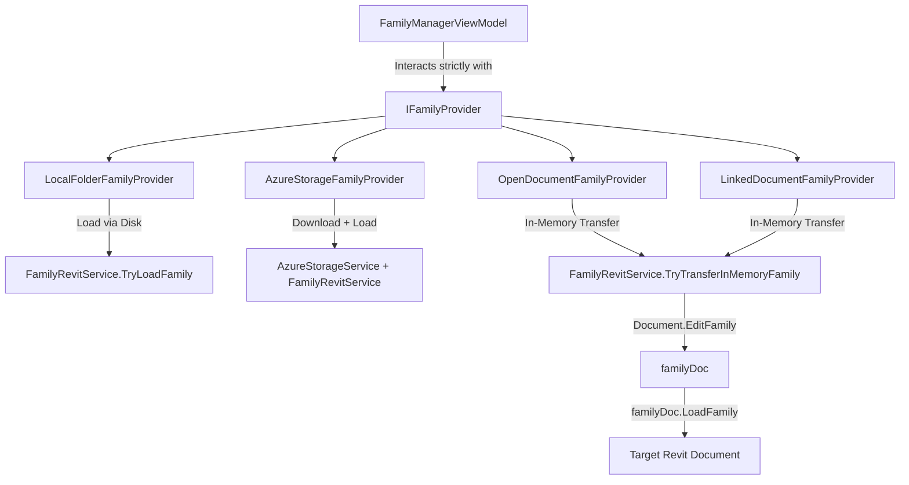

# Implementation Plan — Provider Pattern Architecture (`IFamilyProvider`) & In-Memory Family Transfer Strategy

## 📅 Registration Date: 2026-08-03
## 🌿 Git Branch: `TransferFamily` (based on `TransferPlus`)

---

## 1. Overview
This plan establishes a robust **Provider Pattern (`IFamilyProvider`)** to unify family retrieval and transfer across all 4 family source types (**Local Folder**, **Azure Storage**, **Open Document**, and **Linked Document**).

Additionally, it resolves the technical evaluation for transferring families between open/linked documents by enforcing the **Revit API Best Practice**: using `Document.EditFamily(family)` in memory and calling `familyDoc.LoadFamily(destDoc, silentOverwriteOptions)` without file I/O overhead or `CopyElements` duplication issues.

---

## 2. Technical Evaluation: In-Memory Family Transfer Strategy

### Option Comparison for Open / Linked Models

| Feature / Criteria | Option 1: `CopyElements` | Option 2: `Document.EditFamily` -> `LoadFamily` (Recommended) |
| :--- | :--- | :--- |
| **Revit API Intent** | Designed for model elements/instances in views. | **Designed specifically for Family definitions & parameters.** |
| **Parameter Reconciliation** | Fails or overwrites inconsistently. | Preserves nested parameters, type parameters, and formulas cleanly. |
| **Avoid Duplicate Naming (`CopyOf_`)**| High risk of creating `CopyOf_` suffixed types. | **Zero risk**. Overwrites or updates cleanly via `IFamilyLoadOptions`. |
| **Worksharing & Performance** | Can fail across different document contexts. | **Fast in-memory operation** without disk write delays. |

> [!IMPORTANT]
> **Decision**: We will implement **Option 2 (`Document.EditFamily` -> `familyDoc.LoadFamily(destDoc)`)**. It is the official, safest, and most reliable Revit API method for transferring families between open or linked documents.

---

## 3. Architecture & Provider Design



---

## 4. Provider Interface Specification (`IFamilyProvider.cs`)

```csharp
namespace TransferPlus.Services.Providers;

public interface IFamilyProvider
{
    string ProviderName { get; }
    FamilySourceType SourceType { get; }
    
    Task<IEnumerable<FamilyItemModel>> GetFamiliesAsync(CancellationToken cancellationToken = default);
    Task<bool> TransferFamilyAsync(FamilyItemModel familyItem, Document destinationDoc, CancellationToken cancellationToken = default);
}
```

### Concrete Provider Implementations:

1. **`LocalFolderFamilyProvider`**:
   - Queries `.rfa` files in the configured local directory.
   - Transfer: Calls `FamilyRevitService.TryLoadFamily(destDoc, rfaPath)`.

2. **`AzureStorageFamilyProvider`**:
   - Queries `.rfa` blobs via `AzureStorageService.GetAvailableFamiliesAsync()`.
   - Transfer: Asynchronously streams blob to local temp file via `DownloadFamilyBlobAsync()`, then calls `FamilyRevitService.TryLoadFamily(destDoc, tempPath)`.

3. **`OpenDocumentFamilyProvider`**:
   - Queries `Family` elements in a source open Revit `Document` via `FilteredElementCollector`.
   - Transfer: Calls `FamilyRevitService.TryTransferInMemoryFamily(sourceDoc, sourceFamily, destDoc)` using `sourceDoc.EditFamily(sourceFamily)` -> `familyDoc.LoadFamily(destDoc)`.

4. **`LinkedDocumentFamilyProvider`**:
   - Obtains linked `Document` via `RevitLinkInstance.GetLinkDocument()`.
   - Transfer: Calls `FamilyRevitService.TryTransferInMemoryFamily(linkDoc, linkFamily, destDoc)` using `linkDoc.EditFamily(linkFamily)` -> `familyDoc.LoadFamily(destDoc)`.

---

## 5. Proposed Changes Summary

### Core Provider Abstractions & Services
- `IFamilyProvider.cs`: Unified interface.
- `LocalFolderFamilyProvider.cs`: Local folder implementation.
- `AzureStorageFamilyProvider.cs`: Azure Blob implementation.
- `OpenDocumentFamilyProvider.cs`: Open Revit document implementation.
- `LinkedDocumentFamilyProvider.cs`: Linked Revit model implementation.
- `FamilyProviderFactory.cs`: Factory for resolving active provider.
- `FamilyRevitService.cs`: Added `TryTransferInMemoryFamily(sourceDoc, sourceFamily, targetDoc)`.

### ViewModels
- `FamilyManagerViewModel.cs`: Refactored to consume `IFamilyProvider`.

---

## 6. Verification Plan

### Automated Build Verification
```powershell
dotnet build "TransferPlus\TransferPlus.csproj" -c "Debug R24"
```

### Functional Verification
1. Test family listing and transfer from a Local Folder.
2. Test family listing and transfer from Azure Storage.
3. Test family listing and in-memory transfer from an Open Revit Document.
4. Test family listing and in-memory transfer from a Linked Revit Model.
