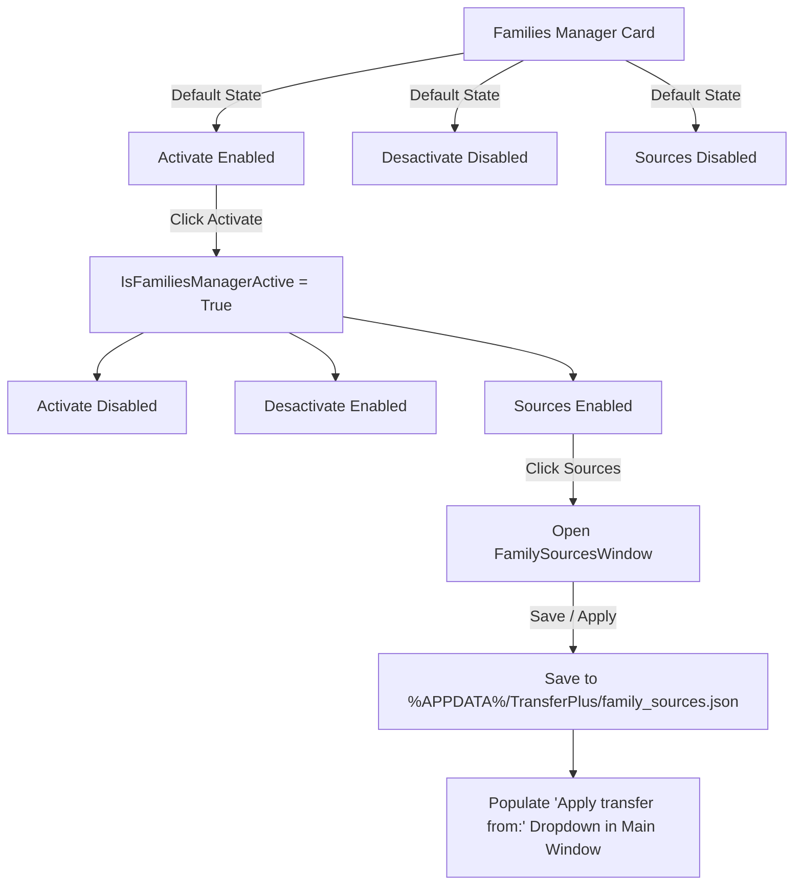

# Implementation Plan — Integration of Family Sources Configuration Window & Persistence in TransferPlus

## 📅 Registration Date: 2026-08-03
## 🌿 Git Branch: `TransferFamily` (based on `TransferPlus`)

---

## 1. Overview
This plan details the implementation of the **Sources** button within the "Families Manager" card in `TransferPlusView.xaml`, the **Family Sources Configuration** window system, and the **Persistence Architecture** that retains configured family sources across Revit sessions and file changes.

Taking inspiration from `references_examples\BimFM`, the solution is adapted to **TransferPlus** architectural standards (C# 12, `CommunityToolkit.Mvvm`, WPF Virtualization, Fluent UI aesthetics, and `security-engineer` hardening).

---

## 2. Design & Functional Requirements

### 2.1. Families Manager Card Button Row (`TransferPlusView.xaml`)
- Expand the button grid in the "Families Manager" card from 2 columns to 3 columns:
  - **Left Button (`Activate`)**: Primary blue style when active; disabled when activated.
  - **Middle Button (`Desactivate`)**: Disabled by default; primary blue style when `Activate` is pressed.
  - **Right Button (`Sources`)**: 
    - Text: **"Sources"**.
    - Default State: **Disabled** (`IsEnabled="False"`).
    - Enabled State: Becomes **Enabled** when `Activate` is pressed.
    - Style: Neutral secondary outline style (similar to `Cancel` / `Clear` buttons in TransferPlus: `#FFFFFF` background, `#CCCCCC` border, `#333333` text, hover effect `#F5F5F5`).
    - Action: Clicking `Sources` opens the **Family Sources Configuration Window** (`FamilySourcesWindow.xaml`).



---

### 2.2. Family Sources Configuration Window (`FamilySourcesWindow.xaml` / `FamilySourcesViewModel.cs`)
- **Visual Design**: Modern Fluent dialog matching TransferPlus design tokens (window height 540px, width 720px, clean card borders, smooth drop-shadows).
- **Top Info Banner (Soft Green)**:
  - Background: Soft green (`#E8F5E9`), Border: `#C3E6CB`, Text: `#155724`.
  - Content: Explains that configured active family sources will be populated in the main window's `"Apply transfer from:"` dropdown list to browse and transfer families/types.
- **Action Toolbar**:
  - Buttons: `[+ Add]`, `[Edit]`, `[Remove]`.
  - `Add`: Displays the **Source Type Selection Dialog**.
  - `Edit`: Opens the configuration dialog for the selected row item.
  - `Remove`: Removes the selected source after user confirmation.
- **Data Grid / ListView**:
  - Columns:
    1. **Active**: CheckBox to toggle source availability in TransferPlus.
    2. **Name**: Alias or display name of the family source.
    3. **Source**: Directory file path (e.g. `C:\Families\Annotations`) or Azure Container path (e.g. `Azure: Families`).
  - Virtualization enabled (`VirtualizingStackPanel.IsVirtualizing="True"`).
- **Footer Buttons**:
  - `Apply` / `Save` (Primary blue button `#007ACC`): Persists changes to disk and updates the main window dropdown.
  - `Cancel` (Secondary neutral button).

---

### 2.3. Source Management Dialogs

#### A. Source Type Selector Dialog (`FamilySourceTypeWindow.xaml`)
- Allows picking between:
  - **Directory** (Local / Network folder containing `.rfa` files).
  - **Azure Storage** (Azure Blob storage container containing `.rfa` files).
- Buttons: `OK` and `Cancel`.

#### B. Directory Source Configuration Dialog (`DirectorySourceWindow.xaml`)
- Soft green header banner explaining directory source configuration.
- Fields:
  - `Name`: Alias text input (e.g., "Architecture Families").
  - `Directory`: Path text input + Folder Picker button (`OpenFolderDialog` / `FolderBrowserDialog`).
  - `Active`: CheckBox.
- Buttons: `OK` and `Cancel`.

#### C. Azure Storage Source Configuration Dialog (`AzureStorageSourceWindow.xaml`)
- Soft green header banner explaining Azure Storage configuration.
- Fields:
  - `Name`: Alias text input.
  - `Endpoint url`: Azure Blob endpoint (e.g., `https://account.blob.core.windows.net`).
  - `Client ID`: Azure AD app client ID.
  - `Tenant ID`: Azure AD tenant ID.
  - `Container name`: Blob container name.
  - `Root path`: Virtual subfolder path inside container.
  - `Active`: CheckBox.
  - `Status Indicator`: "Signed in as: Not signed in".
- Buttons: `OK` and `Cancel`.

---

### 2.4. Persistence Architecture & Security Hardening

- **Storage Location**: `%APPDATA%\TransferPlus\family_sources.json`.
- **Lifecycle & Integration**:
  - `FamilySourceConfigService` loads all configured sources on add-in startup and when TransferPlus main window initializes.
  - Active sources (`IsActive == true`) are populated into the `"Apply transfer from:"` dropdown list alongside open Revit documents.
  - Configuration persists across Revit sessions, add-in restarts, and file switches so users never need to re-configure their sources.
- **Security Engineer Compliance**:
  - Strict path validation using `Path.GetFullPath()` to prevent Path Traversal attacks (`../`).
  - Sanitization of Windows user profiles (`%USERPROFILE%`) in log traces and paths to prevent PII leakage.

---

## 3. Proposed Changes Summary

### Main Window
- `TransferPlusView.xaml`: 3-column button layout in Families Manager card (`Activate`, `Desactivate`, `Sources`).
- `TransferPlusViewModel.cs`: Integration of `OpenSourcesWindowCommand` and source dropdown population.

### Data Models & Services
- `FamilySourceItemModel.cs`: Source data entity.
- `FamilySourceConfigService.cs`: JSON persistence and path validation service.

### Dialog Views & ViewModels
- `FamilySourcesWindow.xaml` & `FamilySourcesViewModel.cs`
- `FamilySourceTypeWindow.xaml` & `FamilySourceTypeViewModel.cs`
- `DirectorySourceWindow.xaml` & `DirectorySourceViewModel.cs`
- `AzureStorageSourceWindow.xaml` & `AzureStorageSourceViewModel.cs`

---

## 4. Verification Plan

### Automated Build Verification
```powershell
dotnet build "TransferPlus\TransferPlus.csproj" -c "Debug R24"
```

### Functional Flow
1. Verify `Sources` button is disabled until `Activate` is pressed.
2. Open `FamilySourcesWindow`, add a Directory source and an Azure Storage source.
3. Save configuration, close Revit, and reopen Revit and TransferPlus.
4. Verify sources persist and automatically appear in `"Apply transfer from:"`.
